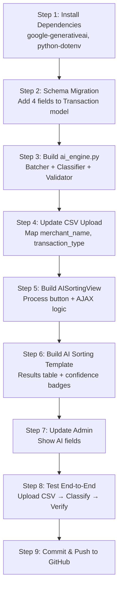

# 🧠 AI Transaction Categorization — Deep Implementation Plan

> **Project:** Smart Transaction Sorter (Smart Sorter)
> **Version:** 2.1 — AI Integration Phase
> **Date:** 2026-05-18

---

## 1. Your Data at a Glance

I analyzed [hybrid_pakistani_transactions_SyntheticDataset Expanded.csv](file:///d:/my_django_project/CSV%20Upload%20Test/hybrid_pakistani_transactions_SyntheticDataset%20Expanded.csv) and here is what we are working with:

| Metric | Value |
|---|---|
| Total rows | 50 |
| Columns | `Transaction_ID`, `Date`, `Raw_Description`, `Merchant_Name`, `Transaction_Type`, `Amount`, `Comments`, `Target_Category` |
| Unique categories | 6: Groceries (14), Dining (11), Transfers (8), Transport (6), Shopping (6), Utilities (5) |
| Transaction types | POS Swipe (29), Online Purchase (8), Wallet Transfer (7), Bill Payment (5), Bank Transfer (1) |
| Rows with comments | 16/50 (32%) — most rows have **no comments** |
| Unique merchants | 18 (Carrefour, KFC, Uber, Daraz, K-Electric, etc.) |

### Key Observations for AI Design
1. **Merchant Name is the strongest signal.** "Carrefour" → Groceries, "KFC" → Dining, "Uber" → Transport. This alone could classify ~70% of transactions.
2. **Transaction Type is a secondary signal.** "Bill Payment" → likely Utilities. "Wallet Transfer" → likely Transfers.
3. **Comments are sparse but valuable.** Only 32% of rows have them, but when present they are gold: "rent", "monthly bill", "office commute".
4. **Amount is a weak signal.** A ₹5000 charge could be Groceries or Shopping. Not reliable alone but helps in edge cases.
5. **Date/Time is a contextual signal.** Late-night orders more likely Dining. Not critical but adds nuance.

---

## 2. Architecture Overview

### Why Gemini LLM (and not a custom ML model)?

| Approach | Pros | Cons | Verdict |
|---|---|---|---|
| **Custom ML (sklearn/TF)** | No API cost, full control | Needs 5,000+ labeled rows to train, brittle to new merchants, requires retraining | ❌ Overkill for your scale |
| **Rule-based (if/else)** | Zero cost, instant | Breaks on unknown merchants, unmaintainable, no fuzzy matching | ❌ Too fragile |
| **LLM (Gemini Flash)** | Understands context naturally, handles new merchants, zero training data needed, works on 50 or 50,000 rows | API cost (~$0.0001/request at Flash tier), network dependency | ✅ **Best fit for your case** |

**Reasoning for your specific case:**
- You have only 50 rows and 6 categories — a custom ML model would massively overfit.
- Pakistani merchant names (Carrefour-ISB, Total Parco, Easypaisa) need *contextual understanding* that only an LLM provides.
- Gemini Flash is nearly free at this scale. Even 10,000 transactions would cost less than $0.50.
- Your sequence diagram already specifies `predict(description, categoryList)` → Gemini handles this natively.

### Data Flow (Matching Your Sequence Diagram)

```
User clicks "Process" on AI Sorting page
        │
        ▼
┌─── AISortingView (Django View) ───┐
│  1. Fetch user's categories       │ ──→ DB: Category.objects.filter(user=...)
│  2. Fetch uncategorized txns      │ ──→ DB: Transaction.objects.filter(category=NULL)
│  3. Batch into groups of 25       │
│  4. Call AIEngine.classify()      │
└───────────┬───────────────────────┘
            │
            ▼
┌─── AIEngine (ai_engine.py) ───────┐
│  1. Build prompt with txn data    │
│     + user's category list        │
│  2. Call Gemini Flash API          │
│  3. Parse JSON response            │
│  4. Validate categories exist      │
│  5. Return {txn_id: category_name} │
└───────────┬───────────────────────┘
            │
            ▼
┌─── AISortingView (continued) ─────┐
│  6. Map category names → IDs       │
│  7. bulk_update() transactions     │ ──→ DB: UPDATE SET category_id
│  8. Return results to template     │
└───────────────────────────────────┘
```

---

## 3. Schema Changes Required

### Current Transaction Model (What We Have)
```python
# pages/models.py — Transaction
date           # DateField
description    # CharField(255) — currently stores "Raw_Description"
amount         # Decimal
notes          # TextField (optional)
category       # FK to Category (nullable)
```

### What We Need to Add
The current `Transaction` model stores `description` but the CSV has richer data: `Raw_Description`, `Merchant_Name`, `Transaction_Type`. We need fields for these.

```diff
# pages/models.py — Transaction (proposed changes)
  date
  description     # Keep — stores Raw_Description
  amount
  notes           # Keep — stores Comments
  category        # Keep — FK, starts as NULL
+ merchant_name   # NEW — CharField(100), nullable. Stores "Carrefour", "KFC" etc.
+ transaction_type # NEW — CharField(50), nullable. Stores "POS Swipe", "Bill Payment" etc.
+ ai_confidence    # NEW — FloatField, nullable. Stores 0.0–1.0 confidence score
+ is_ai_categorized # NEW — BooleanField, default=False. Tracks if AI or human set the category
```

> [!IMPORTANT]
> **Why add `merchant_name` and `transaction_type` separately?**
> These are the two strongest AI signals. By storing them as separate fields (not buried inside `description`), we can:
> 1. Display them cleanly in the UI and Admin
> 2. Let the AI use them as structured inputs (more accurate than parsing free text)
> 3. Enable future features like "spending by merchant" reports

---

## 4. The CSV Upload Pipeline (Enhanced)

### Current Flow (What We Have)
```
CSV → validate headers (date, description, amount) → save each row as Transaction
```

### Enhanced Flow (What We Need)
```
CSV Upload
  │
  ├─ Phase 1: INGEST (existing, with enhancements)
  │   ├─ Validate headers: date, description, amount (required)
  │   ├─ Map optional columns: merchant_name, transaction_type, comments
  │   ├─ Parse & save as Transaction objects (category = NULL)
  │   └─ Store merchant_name and transaction_type if columns exist
  │
  └─ Phase 2: CLASSIFY (new — triggered separately)
      ├─ User navigates to "AI Sorting" page
      ├─ Clicks "Process Uncategorized"
      ├─ System batches NULL-category transactions (25 per batch)
      ├─ Sends each batch to Gemini with the user's category list
      ├─ Parses response, validates, bulk_updates DB
      └─ Shows results summary
```

> [!TIP]
> **Why separate Upload and Classification?**
> 1. **Speed:** Upload should be instant. AI classification takes 2-5 seconds per batch. Users shouldn't wait.
> 2. **Control:** Users can review uploaded data before AI touches it.
> 3. **Retry-ability:** If AI fails, the raw data is safe. User can retry classification without re-uploading.
> 4. **Matches your sequence diagram:** The diagram shows `click("Process")` as a separate action.

---

## 5. The AI Engine — Detailed Design

### File: `pages/ai_engine.py` (NEW)

This is the core intelligence module. It has three responsibilities:

#### A. Batching Service
```python
class TransactionBatcher:
    BATCH_SIZE = 25  # Not 50 — see reasoning below

    def get_uncategorized(self, user):
        """Fetch all transactions without a category for this user."""
        return Transaction.objects.filter(user=user, category__isnull=True)

    def create_batches(self, queryset):
        """Split queryset into chunks of BATCH_SIZE."""
        # Returns list of lists
```

> [!NOTE]
> **Why batch size of 25 instead of 50?**
> - Gemini Flash has an input limit. Each transaction with merchant + description + type + comments ≈ 40 tokens.
> - 25 × 40 = 1,000 tokens input + ~500 tokens output = well within the 8K context window.
> - Smaller batches = more reliable JSON parsing. Large batches increase the chance of malformed JSON.
> - If one batch fails, we only lose 25 rows, not 50.

#### B. Prompt Engineering
This is the most critical part. The prompt must:
1. Give Gemini the user's **exact category list** (so it only picks from valid options)
2. Provide the transaction data in a structured format
3. Enforce **strict JSON output** (no markdown, no explanation)
4. Include a confidence score

```
SYSTEM PROMPT:
"You are a financial transaction classifier for Pakistani bank statements.
Given a list of transactions and a set of valid categories, classify each transaction.

RULES:
1. You MUST only use categories from the provided list.
2. If unsure, use 'Uncategorized'.
3. Return ONLY a JSON array. No markdown, no explanation.
4. Each item must have: id (int), category (string), confidence (float 0-1).

VALID CATEGORIES: {user_categories}

TRANSACTIONS:
{batch_data}

RESPOND WITH ONLY:
[{"id": 1, "category": "Groceries", "confidence": 0.95}, ...]"
```

#### C. Response Validator
```python
class ResponseValidator:
    def validate(self, ai_response, valid_categories):
        """
        1. Try to parse JSON
        2. Check each item has 'id', 'category', 'confidence'
        3. If category not in valid_categories → set to "Uncategorized"
        4. If confidence < 0.5 → set to "Uncategorized" (per your sequence diagram)
        """
```

---

## 6. What **I** Will Build (vs. What **You** Need to Provide)

### ✅ What I Will Code Entirely
| Component | File | Description |
|---|---|---|
| Schema migration | `pages/models.py` | Add `merchant_name`, `transaction_type`, `ai_confidence`, `is_ai_categorized` fields |
| AI Engine | `pages/ai_engine.py` | `TransactionBatcher`, `GeminiClassifier`, `ResponseValidator` classes |
| Enhanced CSV Upload | `pages/views.py` | Update `TransactionUploadView` to map new CSV columns |
| AI Sorting View | `pages/views.py` | Replace placeholder `AISortingView` with functional classification logic |
| AI Sorting Template | `templates/ai_sorting.html` | Full UI: "Process" button, progress indicator, results table |
| Admin enhancements | `pages/admin.py` | Show `ai_confidence`, `is_ai_categorized` in Transaction list |
| URL wiring | `pages/urls.py` | Add AJAX endpoint for AI processing |
| Error handling | `pages/ai_engine.py` | Timeout, retry, fallback to "Uncategorized" |
| Environment config | `myproject/settings.py` | `GEMINI_API_KEY` from env variable |

### 🔑 What You Need to Provide (1 thing only)
| Item | How to Get It | Where to Put It |
|---|---|---|
| **Gemini API Key** | Go to [Google AI Studio](https://aistudio.google.com/apikey), sign in with your Google account, click "Create API Key" → copy it | Create a file `D:\my_django_project\.env` and add: `GEMINI_API_KEY=your_key_here` |

> [!CAUTION]
> **NEVER put the API key directly in `settings.py` or commit it to GitHub.** We will use `python-dotenv` to load it from `.env`, and `.env` is already in `.gitignore`.

---

## 7. Files to Create/Modify

### New Files
| File | Purpose |
|---|---|
| `pages/ai_engine.py` | Core AI logic (Batcher, Classifier, Validator) |
| `.env` | API key storage (user creates this) |

### Modified Files
| File | Changes |
|---|---|
| `pages/models.py` | Add 4 new fields to `Transaction` |
| `pages/views.py` | Rewrite `AISortingView`, update `TransactionUploadView` |
| `pages/admin.py` | Enhanced `TransactionAdmin` with AI fields |
| `pages/urls.py` | Add `/ai-sorting/process/` endpoint |
| `templates/ai_sorting.html` | Full functional UI replacing placeholder |
| `myproject/settings.py` | Add `GEMINI_API_KEY` config |
| `requirements.txt` or pip install | Add `google-generativeai`, `python-dotenv` |

---

## 8. Implementation Order (Step-by-Step)



### Estimated Effort
| Step | Time | Complexity |
|---|---|---|
| Steps 1-2 (Setup) | ~5 min | Low |
| Step 3 (AI Engine) | ~15 min | **High** — core logic |
| Steps 4-6 (Views/Templates) | ~15 min | Medium |
| Steps 7-9 (Polish/Test) | ~10 min | Low |
| **Total** | **~45 min** | — |

---

## 9. How Training Would Work (Future Enhancement)

> [!NOTE]
> This section is for **future reference only**. We are NOT building this now.

Currently, Gemini classifies based on general knowledge (zero-shot). For higher accuracy, you could later add:

1. **Feedback Loop:** When a user manually corrects an AI category, store the correction. After 200+ corrections, use them as "few-shot examples" in the prompt.
2. **Merchant Memory:** Build a `MerchantCategoryMapping` table. If "Carrefour" has been classified as "Groceries" 50 times, skip the AI and auto-assign.
3. **Fine-tuning:** If you accumulate 5,000+ labeled transactions, you could fine-tune a smaller model. But this is unnecessary for your FYP scale.

---

## 10. Summary

| Question | Answer |
|---|---|
| Can I build this entirely via code? | **Yes.** You only need to provide a Gemini API key. |
| How does the AI decide the category? | It reads `merchant_name`, `raw_description`, `transaction_type`, `comments`, and `amount`, then picks the best match from the user's category list. |
| What if the AI is wrong? | The user can manually change the category. Low-confidence predictions (< 50%) auto-assign to "Uncategorized". |
| What if a merchant is unknown? | Gemini uses contextual clues (description, type, comments). If truly ambiguous, it returns "Uncategorized". |
| Is this best practice for my case? | **Yes.** For a 50-row, 6-category, Pakistani-merchant dataset, an LLM is the most pragmatic choice. No training data needed, handles Urdu/English mixed text, and costs nearly nothing. |

> [!IMPORTANT]
> **Next Step:** Please confirm this plan and provide your Gemini API key. I will then begin implementation starting from Step 1.
