# Smart Transaction Sorter & Analytics System
**Final Year Project (Phase-I) Documentation**

**Developed By:**
* Rida Eman (BS CS Aut-22-M-A-0039)
* Muhammad Mahhin Shahzad (BS CS Aut-22-M-A-0030)

**Supervised By:**
* Mr. Naeem Akhter Malik (Lecturer, Department of Computer Science)

**Institution:**
* Federal Urdu University of Arts, Science and Technology, Islamabad
* Session [2022-2026]

---

## Project in Brief

| Attribute | Details |
| :--- | :--- |
| **Project Title** | Smart Transaction Sorter & Analytics System |
| **Organization** | Federal Urdu University of Arts, Science and Technology |
| **Objectives** | • Develop an independent web platform to ingest raw, unstructured CSV transaction exports from local digital wallets.<br>• Utilize a Large Language Model (LLM) to automatically categorize messy transaction descriptions into user-defined labels.<br>• Generate interactive Business Intelligence (BI) dashboards to visualize spending patterns without manual data entry.<br>• Deliver a proof-of-concept demonstrating how AI can solve the analytics gap in the Pakistani fintech market. |
| **Undertaken By** | Rida Eman, Muhammad Mahhin Shahzad |
| **Supervised By** | Mr. Naeem Akhter Malik |
| **Date Started** | 2nd October, 2025 |
| **Date Completed** | 28th June, 2026 |
| **Technologies Used** | Python, Django Framework, PostgreSQL, Pandas, Gemini API, Metabase, Plotly.js, Tailwind CSS, JavaScript, HTML5 |
| **System Used** | 12th Gen Intel Core i5 Processor, 16 GB RAM, 256 SSD |

---

## Abstract

The fast-paced rise of digital commerce in Pakistan has resulted in an increasing number of individuals utilizing various fintech applications. However, the lack of adequate analytics tools makes it difficult for individuals to extract useful information from their transactions. In Pakistan, current solutions often lack this feature, leaving the user to manually tag and classify each item in their financial history. 

In response to this problem, this project presents the design and implementation of the Smart Transaction Sorter & Analytics System, which is a web application meant to assist users in understanding their financial behavior. The solution comprises multiple modules, namely user authentication, category management, and a data ingestion engine that reads CSV files.

One of the major components of the system is the sorting module that uses a pre-trained language model to automatically assign user-specified categories to transaction descriptions. After the processing phase, users can visualize the results in the form of an interactive Business Intelligence (BI) dashboard that provides a comprehensive analysis based on various charts and graphs. The Smart Transaction Sorter & Analytics System was built using the Django framework and its Model-View-Template (MVT) architecture.

---

## Chapter 1: Introduction

### 1.1 Introduction
The rise of the digital economy in Pakistan has been driven by the widespread adoption of fintech platforms such as Easypaisa, SadaPay, and JazzCash. These services have empowered millions of users by simplifying payments and providing instant access to their complete transaction history. This readily available data holds the potential to offer valuable insights into personal spending habits. However, for most users, this potential remains untapped as the data is typically provided in raw formats (e.g., CSV files) without sophisticated analytical tools.

This proposal introduces the Smart Transaction Sorter and Analytics system, a web-based application designed to unlock the value hidden within this raw financial data. The project's academic objective is to develop a functional, standalone tool that serves as a research-based feasibility study. The resulting application will be architected as a powerful blueprint for an intelligent analytics module. The long-term vision, while outside the immediate scope of this project, is that such a module could be pitched for integration into the very fintech platforms it complements, thereby closing the significant analytical gap in the current market.

### 1.2 Problem Statement
The problem is the absence of an integrated Business Intelligence (BI) and analytics layer in Pakistan digital wallets. People export their data, move it into another tool, and tag each transaction by hand. It's a manual and time-consuming process.

### 1.3 Proposed System
The proposed system is a standalone, web-based application focused on delivering a complete workflow from raw CSV data to a finalized BI dashboard. To automate data preparation for the dashboard, an intelligent sorting component leveraging a pre-trained language model capable of contextual understanding will be included. The system aims to demonstrate feasibility using publicly available, realistic transaction data. The core functionality is broken down as follows:

1. **Custom Category Management:** The user will first define their own set of personal spending categories (e.g., Groceries, Transport, Health & Fitness).
2. **CSV Data Ingestion:** The user then uploads their transaction history as a standard CSV file. This serves as the primary data input mechanism.
3. **Intelligent Sorting Component:** A smart classification component, utilizing the pre-trained language model, will process the raw data. It will analyze transaction descriptions and human-like notes/comments, mapping each entry to the most relevant category from the user's own custom list. This automated step moves beyond simple rule-based mapping to understand context, preparing the data accurately for the BI layer.
4. **Interactive BI Visualization:** Once sorted, the data is presented to the user through an interactive Business Intelligence (BI) dashboard. This dashboard is the primary output and will feature charts and graphs visualizing spending breakdowns tailored to the user's personal financial structure.
5. **Validation with Public Data:** To demonstrate the effectiveness and real-world applicability of the sorting component, the system will be tested and validated using a relevant public dataset. This dataset will contain transaction-like entries with descriptions and comments, allowing for rigorous evaluation of the classification accuracy without relying on proprietary user data.

### 1.4 Survey of the Related Applications
To establish the necessity of this project, this survey analyzes two distinct application categories: the local digital wallets that create the data and the problem, and the global expense trackers that represent existing but flawed solutions.

#### A. Market Survey - Local Digital Wallets (Direct Context)
A review of the official documentation for Pakistan's leading digital wallets confirms that while they excel at payments, they generally lack a mature, integrated analytics tool.
* **SadaPay, NayaPay, & Easypaisa:** These platforms reliably provide users with the ability to download their account statements or view transaction histories, with some confirming CSV export availability. However, their feature sets do not include built-in BI or smart analytics layers.
* **JazzCash:** While also providing standard statements, JazzCash recently announced a Spending Tracker feature. Based on its public introduction, this appears to be a basic tracking tool for monitoring budgets. While a positive step, it is distinct from a full-scale BI layer and does not offer the intelligent, personalized categorization that is central to this proposal.

**Implication:** The local market either offers no native analytics or, at best, provides basic tracking. This creates a clear analytics vacuum and validates the need for a separate application to provide the missing intelligence.

#### B. Indirect Comparators - Global CSV-Import Tools
Global platforms like YNAB and Mint demonstrate the feasibility of the CSV-import workflow but are poorly suited to the local context and fail to solve the core problem of personalization.
* **High-Friction Workflow:** Tools like YNAB and Mint, while powerful, still require significant manual effort after a CSV import to clean up data and assign categories line-by-line. This does not solve the primary issue of laborious manual work.
* **Lack of Personalization and Intelligence:** These platforms are separate, often paid services that use rigid, generic categorization systems. They lack the intelligent sorting component needed to learn and adapt to a user's own custom financial categories, failing the key protein bar test case.
* **Misaligned Business Model:** Their primary model is direct bank API integration, which is not the standard in the Pakistani market. Their CSV import tools are a secondary feature, not the core product.

**Implication:** The global tools prove the CSV-to-analytics model is viable but highlight a gap for a more intelligent, low-friction, and personalized solution tailored to the realities of the local market. This project is designed specifically to fill that gap.

### 1.5 Modules & Sub-modules
The system architecture will be broken down into the following modules and sub-modules to ensure a clear separation of concerns and facilitate iterative development.

#### 1.5.1 User & Category Management Module
This module will handle all user-facing administrative tasks and personalization features.
* **Authentication Submodule:** This submodule is responsible for secure user registration, login, logout, and session management to ensure data privacy.
* **Category CRUD Submodule:** This provides the interface and backend logic for users to Create, Read, Update, and Delete (CRUD) their personalized list of spending categories.

#### 1.5.2 Data Ingestion Module
This module serves as the primary data entry point for transaction histories.
* **File Upload Submodule:** This submodule provides the secure, user-facing web form for uploading transaction data in CSV format.
* **CSV Validation Submodule:** This is a backend service that parses the uploaded file and verifies its structural integrity, ensuring required columns (e.g., Date, Description, Amount) are present.

#### 1.5.3 Intelligent Sorting Module
This module contains the core data processing and classification logic.
* **Data Pre-processing Submodule:** This submodule cleans and standardizes the validated data, converting data types (e.g., string dates to date objects) to prepare it for classification.
* **Classification Engine Submodule:** This is the smart component that takes a transaction's text and the user's custom category list as input, and outputs the most probable category.
* **Database Persistence Submodule:** This submodule saves the processed transaction data, along with its newly assigned category, into the database.

#### 1.5.4 BI & Visualization Module
This module is responsible for presenting the final analytical output to the user.
* **Data Aggregation Submodule:** This is a backend service that runs queries on the database to aggregate data for visualization (e.g., calculating total spending per category).
* **Dashboard Rendering Submodule:** This is the frontend component that takes the aggregated data and uses a charting library to render the interactive BI dashboard.

## Chapter 2: Requirements Specification

### 2.1 Purpose
The purpose of the Smart Transaction Sorter and Analytics System is to provide users with an intelligent, automated way to analyze their personal financial spending. This web application uses Artificial Intelligence (AI) to categorize raw transaction data (from CSV files) and instantly convert it into clear, visual charts, eliminating the need for hours of frustrating manual work.

### 2.2 Project Scope
The scope of this project is a standalone, web-based tool that accepts a financial history file (CSV), uses AI to categorize every line based on user-defined labels, and presents the results on a BI Dashboard. The system includes User authentication, Category Management, CSV Upload/Validation, AI Sorting Logic, Data Persistence, and a Visualization Dashboard.

* **In Scope:** User login, Category creation, CSV parsing, AI classification, Dashboard charts.
* **Out of Scope:** Direct integration (API) with bank/wallet accounts, payment processing, or real-time transaction tracking.

### 2.3 Definitions, Acronyms, and Abbreviations

| Term/Abbreviation | Definition |
| :--- | :--- |
| **STS** | Smart Transaction Sorter (The name of this application). |
| **AI** | Artificial Intelligence (The component that performs automatic classification). |
| **CSV** | Comma-Separated Values (The standard file format for data input/upload). |
| **BI** | Business Intelligence (Refers to the analytical dashboard and visualization tools). |
| **DB** | Database (The system storage where user and financial data are saved). |

### 2.4 Document Overview
This document describes the requirements for the Smart Transaction Sorter and Analytics System (STS). It serves as the single reference point for what the system must do and how well it must perform. The STS acts as a complimentary Business Intelligence layer for existing digital wallets and bank applications that currently only offer raw data exports.

---

### 2.5 Functional Requirements

#### 2.5.1 Security Management

**Process: Sign Up**
| ID | Requirement Description |
| :--- | :--- |
| **SRS-1** | The system shall allow new users to securely register by providing a username, email, and password. |
| **SRS-2** | The system must validate that the email address is unique and not already registered. |
| **SRS-3** | The system shall store user passwords using a strong one-way hash (never in plain text). |
| **SRS-4** | Upon successful registration, the system shall create a dedicated, isolated database scope for the user. |

**Process: Sign In / Logout**
| ID | Requirement Description |
| :--- | :--- |
| **SRS-5** | The system shall allow registered users to log in securely using their credentials. |
| **SRS-6** | The system shall use HTTPS/SSL for all data transfer between the client and server to prevent interception. |
| **SRS-7** | The system shall allow users to securely log out, terminating their current session. |

#### 2.5.2 Category Management

**Process: Create Spending Category**
| ID | Requirement Description |
| :--- | :--- |
| **SRS-8** | The system shall allow users to create new, personalized spending category labels (e.g., "Groceries", "Utilities"). |
| **SRS-9** | The system shall validate that the category name is not a duplicate within the user's profile. |
| **SRS-10** | The system shall ensure all created categories are immediately available for the AI Sorting Engine to use. |

**Process: Manage Spending Categories**
| ID | Requirement Description |
| :--- | :--- |
| **SRS-11** | The system shall allow users to view a list of all their existing categories. |
| **SRS-12** | The system shall allow users to edit the name of an existing category. |
| **SRS-13** | The system shall allow users to delete a category (and optionally reassign its associated transactions). |

#### 2.5.3 Data Ingestion Management

**Process: Upload Transaction File (CSV)**
| ID | Requirement Description |
| :--- | :--- |
| **SRS-14** | The system shall provide a simple interface for the user to upload a transaction history file. |
| **SRS-15** | The system is constrained to accepting only CSV (Comma-Separated Values) file formats. |
| **SRS-16** | The system shall provide a progress indicator or status feedback during the upload process. |

**Process: File Validation**
| ID | Requirement Description |
| :--- | :--- |
| **SRS-17** | The system shall check the uploaded file for necessary columns (specifically: Date, Description, and Amount). |
| **SRS-18** | The system shall provide clear, user-friendly error messages if the file structure is invalid or missing data. |
| **SRS-19** | The system shall reject files that exceed a predefined size limit to maintain performance. |

#### 2.5.4 Intelligent Sorting Management

**Process: Process Transactions (AI Sorting)**
| ID | Requirement Description |
| :--- | :--- |
| **SRS-20** | The system shall use a smart classification model (AI) to read transaction descriptions from the uploaded file. |
| **SRS-21** | The system shall automatically assign the most relevant custom category to each transaction. |
| **SRS-22** | The system shall utilize Gemini API for the classification logic. |

**Process: Data Persistence & Saving**
| ID | Requirement Description |
| :--- | :--- |
| **SRS-23** | The system shall securely save the processed transaction data, including the new category label, to the user's database. |
| **SRS-24** | The system shall ensure that once categorized, the financial history persists until explicitly deleted by the user. |

#### 2.5.5 Analytics Management

**Process: View Dashboard**
| ID | Requirement Description |
| :--- | :--- |
| **SRS-25** | The system shall display a primary BI (Business Intelligence) dashboard view after processing is complete. |
| **SRS-26** | The dashboard shall be interactive, allowing users to hover over elements for more details. |

**Process: View Spending Breakdown**
| ID | Requirement Description |
| :--- | :--- |
| **SRS-27** | The system shall display clear charts (e.g., pie charts) visualizing total spending broken down by custom categories. |
| **SRS-28** | The system shall calculate and display total expenditure for the uploaded period. |

#### 2.5.6 Administrator Management

**Process: Admin Panel Access**
| ID | Requirement Description |
| :--- | :--- |
| **SRS-29** | The System Administrator must use distinct credentials to log in to the dedicated administrative interface. |
| **SRS-30** | The Admin Panel shall be secured and inaccessible to standard users. |

**Process: User Account Management**
| ID | Requirement Description |
| :--- | :--- |
| **SRS-31** | The Admin shall have the ability to View and Search for any registered user account. |
| **SRS-32** | The Admin shall have the ability to Create, Edit, or Delete user accounts if necessary. |
| **SRS-33** | The Admin shall have read-only access to view user-created Categories and processed Transactions for auditing purposes. |

---

### 2.6 Non-Functional Requirements

#### 2.6.1 Security
* **Account Protection:** User passwords must be stored using a strong one-way hash.
* **Session Security:** The system must use HTTPS for all communication to prevent data interception.
* **User Isolation:** A user's data must be completely isolated and inaccessible to any other user.

#### 2.6.2 Usability
* The interface must be intuitive, clean, and fully mobile-responsive.
* Training time for a normal user to understand the upload and sort process should be minimal (intuitive design).

#### 2.6.3 Reliability
* The system must be available and function correctly 99.5% of the time.
* In any error scenario, the system must provide an appropriate message and retain the state of the user's data (no silent failures).

#### 2.6.4 Performance
* **File Processing Time:** A standard file (up to 500 transactions) must be processed, sorted by the AI, and ready for viewing within 60 seconds.
* The system dashboard should load visualization results in under 3 seconds after processing is complete.

#### 2.6.5 Design Constraints
* **Technology Stack:** Must use Python (Django Framework) for the backend logic.
* **Database:** Designed for use with PostgreSQL for scalability.
* **AI Library:** The system must utilize the Hugging Face Transformers library.
* **Architecture:** The code must follow the MVT (Model-View-Template) architectural pattern.

#### 2.6.6 Data Ownership & Business Rules
* **Data Ownership:** All uploaded data remains the intellectual property of the User.
* **No Third-Party Sharing:** User financial data may not be shared, sold, or exposed to any third party.
* **Persistence:** Processed data remains available until the user explicitly decides to delete it.

---

### 2.7 External Interface Requirements

#### 2.7.1 User Interfaces
The user interface will be entirely web-based, optimized for responsive viewing on desktop and mobile devices. Key interfaces include:
* Login/Registration Forms.
* Custom Category Management Form (CRUD interface).
* CSV File Upload Interface with progress/status feedback.
* Interactive BI Dashboard (using modern charting libraries like Plotly.js or Chart.js).
* A secure Admin Panel (for System Administrator use only).

#### 2.7.2 Hardware Interfaces
No specialized hardware is required. The system will interface with standard internet-supported client devices (PC, laptop, mobile, tablet).

#### 2.7.3 Software Interfaces
The system interfaces with the following software components:
* **Python/Django:** Primary backend web application and API interface.
* **PostgreSQL:** Database management system for data persistence.
* **Pandas Library:** Used for data manipulation, CSV parsing, and validation.
* **Hugging Face Transformers:** The core library used for the AI classification model.
* **Plotly.js / Chart.js:** Frontend JavaScript libraries for rendering visualizations.

## Chapter 3: Use Case Analysis

### 3.1 Use Case Diagram
The Use Case Diagram provides a high-level overview of the system's interactions with the primary actors (User and System Administrator).

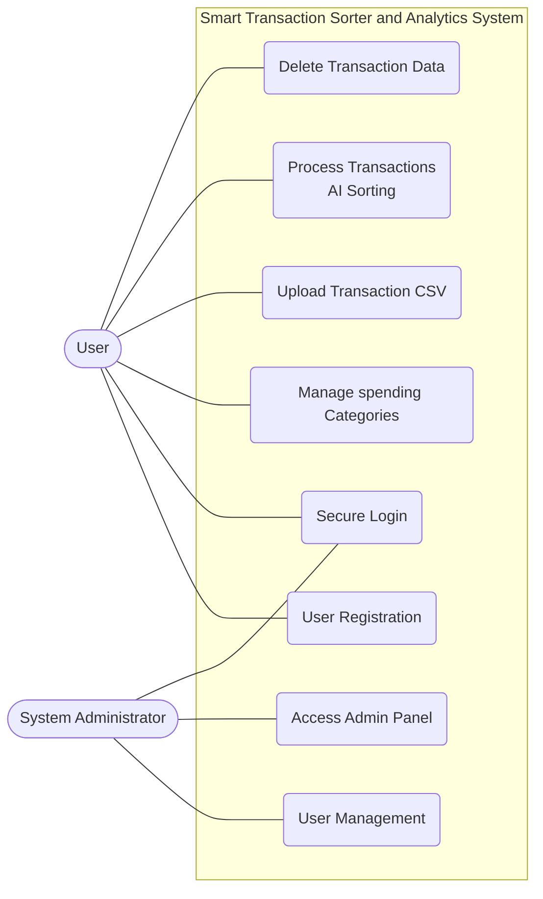

### 3.2 Fully Dressed Use Case Scenarios

#### 3.2.1 User Access & Authentication

**Use Case 1.1: User Registration**
| Attribute | Details |
| :--- | :--- |
| **Use Case ID** | 1.1 |
| **Use Case Name** | User Registration |
| **Actor** | User |
| **Description** | A new user creates a secure account to access the system features. |
| **Preconditions** | User has a valid email address and internet access. |
| **Postconditions** | A new user account is created in the database, and the user is redirected to the login page. |
| **Priority** | High |
| **Normal Course** | 1. User navigates to the application landing page.<br>2. User selects "Register".<br>3. System displays the registration form.<br>4. User enters Name, Email, and Password (twice).<br>5. System validates the input format.<br>6. System hashes the password and saves the new user record.<br>7. System displays a success message. |
| **Alternative Courses** | **5a. Weak Password:**<br>i. System detects password does not meet security complexity requirements.<br>ii. System prompts user to choose a stronger password.<br>**6a. Email Already Exists:**<br>i. Database check confirms the email is already registered.<br>ii. System displays error: "Account already exists".<br>iii. System prompts user for Login. |
| **Exceptions** | Database connection failure prevents account creation. |
| **Special Req.** | Passwords must be hashed using a strong algorithm (e.g., PBKDF2 or Argon2) before storage. |

**Use Case 1.2: Secure Login**
| Attribute | Details |
| :--- | :--- |
| **Use Case ID** | 1.2 |
| **Use Case Name** | Secure Login |
| **Actor** | User, System Administrator |
| **Description** | Users or Admins log in to access their respective dashboards. |
| **Preconditions** | User/Admin must have a registered account. |
| **Postconditions** | Actor is authenticated, a session is established, and they are redirected to their authorized dashboard. |
| **Priority** | High |
| **Normal Course** | 1. Actor navigates to the Login page.<br>2. Actor enters Email and Password.<br>3. System verifies credentials against the database.<br>4. System generates a secure session token.<br>5. System identifies the role (User or Admin) and redirects to the appropriate Dashboard. |
| **Alternative Courses** | **3a. Invalid Credentials:**<br>i. System detects email/password do not match.<br>ii. System displays "Invalid Login" error.<br>iii. System allows retry (limit 5 attempts). |
| **Exceptions** | Account is locked due to too many failed attempts. |
| **Special Req.** | Communication must occur over HTTPS. |

#### 3.2.2 Core Configuration

**Use Case 2.1: Manage Spending Categories**
| Attribute | Details |
| :--- | :--- |
| **Use Case ID** | 2.1 |
| **Use Case Name** | Manage Spending Categories |
| **Actor** | User |
| **Description** | User defines the custom labels (e.g., "Gym", "Groceries") that the AI will use for sorting. |
| **Preconditions** | User is logged in. |
| **Postconditions** | The list of categories is updated in the database and ready for the AI engine. |
| **Priority** | High |
| **Normal Course** | 1. User navigates to "Manage Categories".<br>2. System displays current list of categories.<br>3. User clicks "Add New Category".<br>4. User types a label name.<br>5. System saves the category.<br>6. System confirms update. |
| **Alternative Courses** | **2a. Delete Category:**<br>i. User selects "Delete" on an existing category.<br>ii. System removes the category from the list.<br>**5a. Duplicate Category:**<br>i. User tries to add a category that already exists.<br>ii. System prevents save and shows a duplicate error. |
| **Special Req.** | Categories must be unique per user. |

#### 3.2.3 Data Processing (The AI Core)

**Use Case 3.1: Upload Transaction CSV**
| Attribute | Details |
| :--- | :--- |
| **Use Case ID** | 3.1 |
| **Use Case Name** | Upload Transaction CSV |
| **Actor** | User |
| **Description** | User uploads a raw CSV file from their bank/wallet for processing. |
| **Preconditions** | User is logged in and has a valid CSV file. |
| **Postconditions** | File is parsed, and all transactions are saved to the database with an 'Uncategorized' status. |
| **Priority** | High |
| **Normal Course** | 1. User navigates to "Upload" section.<br>2. User selects a file from local device.<br>3. System scans file type.<br>4. System validates required columns (Date, Description, Amount).<br>5. System parses the file and saves all transactions to the database.<br>6. System confirms successful upload. |
| **Alternative Courses** | **3a. Invalid File Format:**<br>i. System detects file extension is not .csv.<br>ii. System rejects the file.<br>**4a. Missing Columns:**<br>i. System validation fails (missing "Amount" column).<br>ii. System rejects file.<br>iii. System tells User exactly which column is missing. |
| **Exceptions** | File size exceeds server limit (e.g., >10MB). |
| **Special Req.** | Validation must happen immediately before any processing. |

**Use Case 3.2: Process Transactions (AI Sorting)**
| Attribute | Details |
| :--- | :--- |
| **Use Case ID** | 3.2 |
| **Use Case Name** | Process Transactions (AI Sorting) |
| **Actor** | System (Triggered by User) |
| **Description** | The AI engine analyzes transaction descriptions and assigns them to User's custom categories. |
| **Preconditions** | Valid CSV uploaded (UC-3.1) and Categories exist (UC-2.1). |
| **Postconditions** | All transactions are categorized and saved to the database. |
| **Priority** | High |
| **Normal Course** | 1. User initiates "Process".<br>2. System retrieves User's Category List.<br>3. System feeds text descriptions into the AI Classification Engine.<br>4. AI determines best category match for each row.<br>5. System saves classified data to database.<br>6. System notifies User of completion. |
| **Alternative Courses** | **4a. Low Confidence:**<br>i. AI model confidence score is below threshold.<br>ii. System assigns a default "Uncategorized" label.<br>iii. System flags transaction for manual review. |
| **Exceptions** | AI Service timeout. |
| **Special Req.** | Processing 500 records must take < 60 seconds. |

#### 3.2.4 Analytics & Maintenance

**Use Case 4.1: View Analytics Dashboard**
| Attribute | Details |
| :--- | :--- |
| **Use Case ID** | 4.1 |
| **Use Case Name** | View Analytics Dashboard |
| **Actor** | User |
| **Description** | User views interactive charts summarizing their financial data. |
| **Preconditions** | Data has been processed (UC-3.2). |
| **Postconditions** | User gains insight into spending habits. |
| **Priority** | High |
| **Normal Course** | 1. User clicks "Dashboard".<br>2. System aggregates total spending per category.<br>3. System renders charts (Pie/Bar) using plotting libraries.<br>4. User filters view by Date Range (optional). |
| **Alternative Courses** | **2a. No Data:**<br>i. Database query returns no records.<br>ii. System displays "Upload data to see insights" prompt. |
| **Special Req.** | Dashboard must be mobile responsive. |

**Use Case 4.2: Delete Transaction Data**
| Attribute | Details |
| :--- | :--- |
| **Use Case ID** | 4.2 |
| **Use Case Name** | Delete Transaction Data |
| **Actor** | User |
| **Description** | User permanently removes uploaded data from the system. |
| **Preconditions** | User has existing data. |
| **Postconditions** | Data is permanently erased from database. |
| **Priority** | Medium |
| **Normal Course** | 1. User navigates to "Data Management".<br>2. User selects a file batch or "Delete All".<br>3. System displays "Are you sure?" confirmation warning.<br>4. User confirms.<br>5. System performs hard delete of records.<br>6. Dashboard updates to show empty state. |
| **Alternative Courses** | **4a. Cancel Delete:**<br>i. User clicks "Cancel" at confirmation.<br>ii. System retains data and cancels the operation. |
| **Special Req.** | Data must be unrecoverable after deletion (Privacy Rule). |

#### 3.2.5 Administration

**Use Case 5.1: Admin User Management**
| Attribute | Details |
| :--- | :--- |
| **Use Case ID** | 5.1 |
| **Use Case Name** | Admin User Management |
| **Actor** | System Administrator |
| **Description** | Admin manages user accounts and views system usage stats. |
| **Preconditions** | Admin is logged in and authorized. |
| **Postconditions** | User account status is updated. |
| **Priority** | Low |
| **Normal Course** | 1. Admin navigates to the Administrative Panel.<br>2. Admin searches for a User by email.<br>3. System displays User details.<br>4. Admin selects "Edit" or "Delete".<br>5. System processes the administrative action. |
| **Alternative Courses** | **3a. Audit View:**<br>i. Admin selects "View Details".<br>ii. System displays read-only list of User's categories for support purposes. |
| **Exceptions** | Admin cannot view User's raw passwords (hashed). |
| **Special Req.** | Admin actions must be logged. |

---

## Chapter 4: Process Modeling and System Analysis

This chapter focuses on the dynamic aspects of the Smart Transaction Sorter and Analytics System. It details the flow of control and data between various system components and actors. Through the use of Activity Diagrams and System Sequence Diagrams (SSD), we visualize the operational workflows, including authentication, data ingestion, AI-based sorting, and analytics generation, to ensure a clear understanding of the system's runtime behavior.

### 4.1 System Activity Diagram
The Activity Diagram illustrates the operational workflow of the system, detailing the flow of control between the User, the System, and the Intelligent Sorting Module.

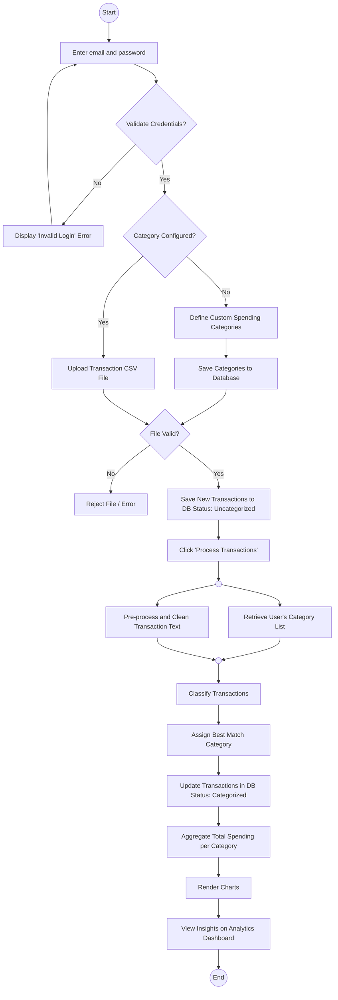

### 4.2 System Sequence Diagrams (SSD)
The System Sequence Diagram (SSD) depicts the interactions between the User, the Smart Transaction System, and the AI Engine over time.

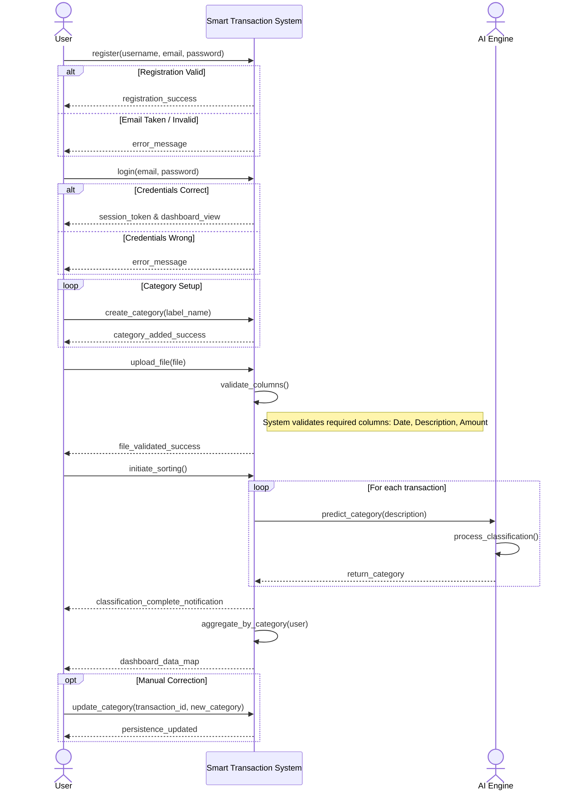

---

## Chapter 5: System Design

### 5.1 Database Design
The database design serves as the foundational data layer for the Smart Transaction Sorter. It ensures that user profiles, custom categories, and large volumes of transaction records are stored efficiently and securely. The design prioritizes data integrity and isolation between different users.

#### 5.1.1 Entity Relationship Diagram (ERD)
The Entity Relationship Diagram visualizes the logical structure of the database. It defines the entities such as Users, Categories, and Transactions and the relationships between them.

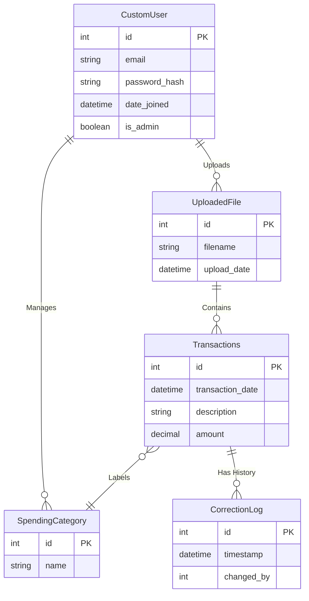

### 5.2 Application Architecture
The application architecture follows a modular structure, separating the user interface, business logic, and data handling. This separation of concerns ensures maintainability and scalability.

#### 5.2.1 Class Diagram
The Class Diagram depicts the static structure of the system. It illustrates the system's classes, their attributes, methods, and the relationships between objects. This includes the Controller classes that handle logic, Service classes that manage data processing, and Model classes that represent the database entities.

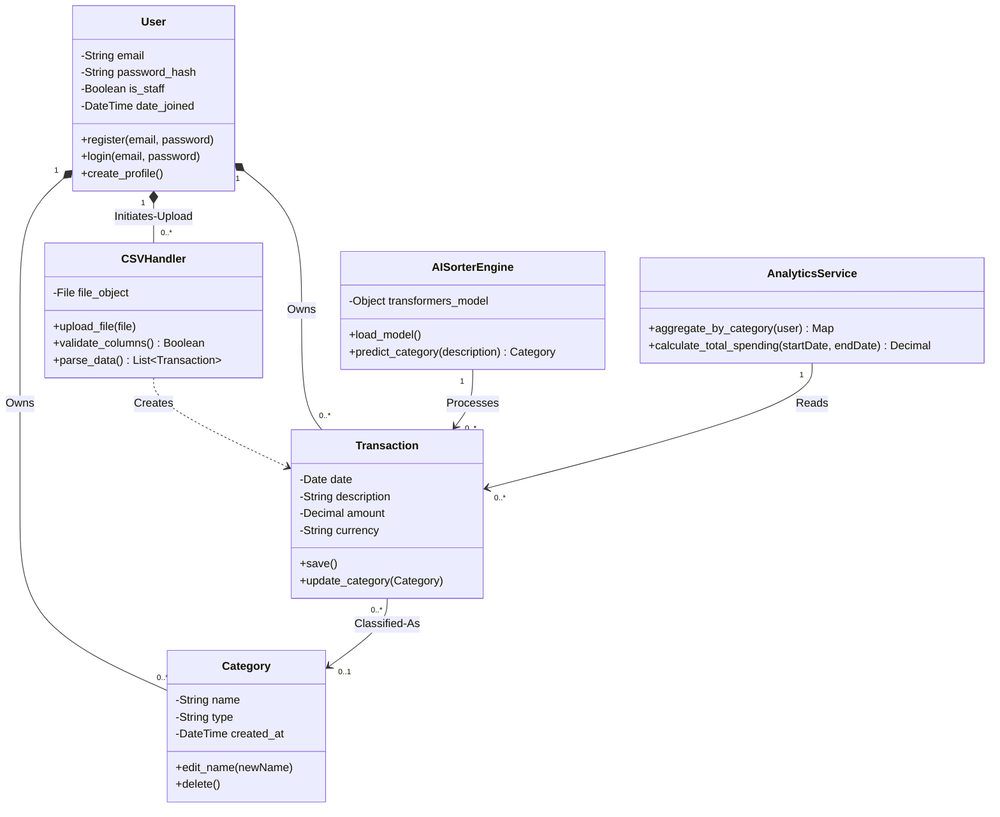

#### 5.2.2 Interaction Design (Sequence Diagrams)

This section details the dynamic behavior of the system. The following Sequence Diagrams illustrate the step-by-step message flow between system objects for the most critical use cases, from the initial user action to the final system response.

#### 1. User Registration Workflow
This interaction details the process of creating a new user account, including validation of unique email addresses and secure password hashing before storage.

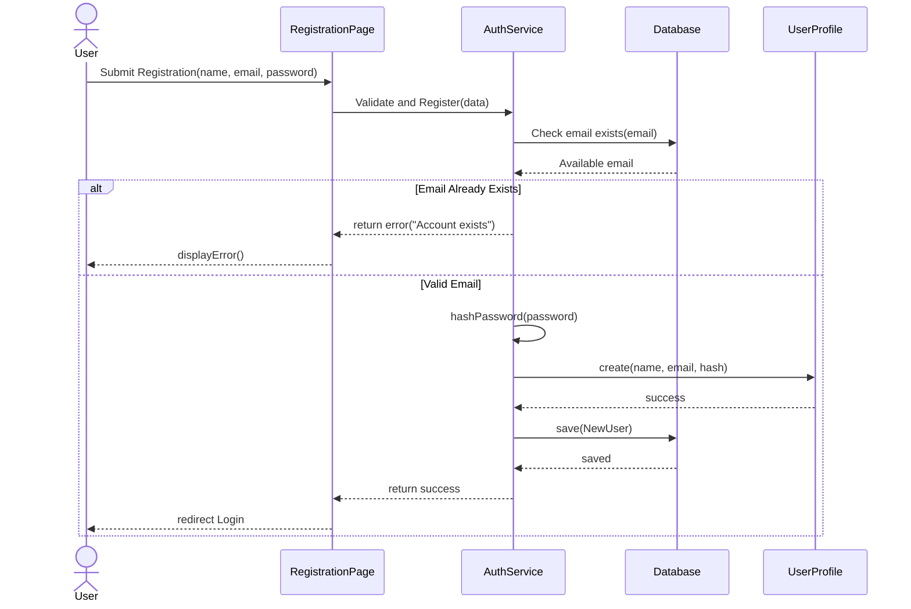

#### 2. Secure Login Workflow
This diagram illustrates the authentication process, verifying credentials against the database and generating a session token upon success.

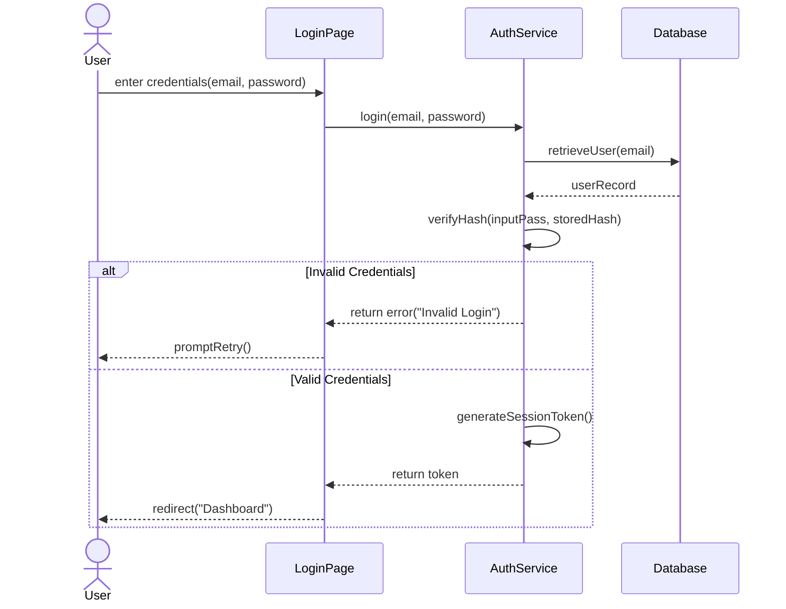

#### 3. Manage Spending Categories Workflow
This flow demonstrates how a user defines custom spending labels (e.g., "Gym", "Groceries") and how the system prevents duplicate category entries.

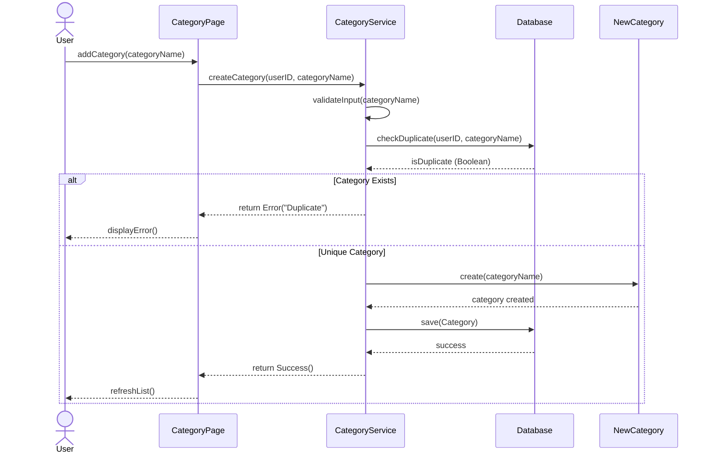

#### 4. CSV Data Upload Workflow
This diagram covers the data ingestion process, including file extension validation (.csv), structure verification (checking columns), and saving raw data.

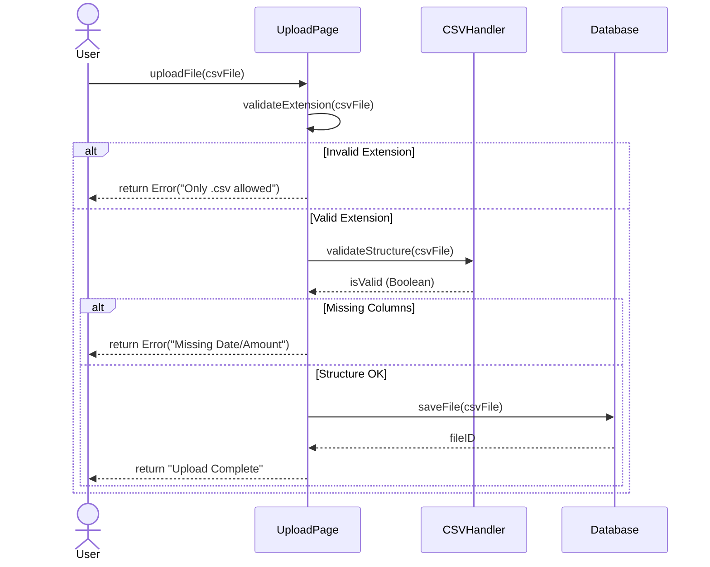

#### 5. AI Transaction Processing Workflow
This is the core system process. It depicts the loop where the AI Engine reads each transaction, predicts the best category based on the user's list, and updates the record.

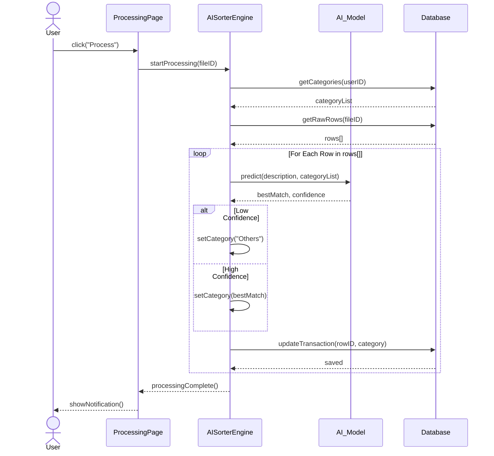

#### 6. Dashboard Analytics Workflow
This interaction shows how the system aggregates classified data from the database and delivers the JSON structure required to render the frontend charts.

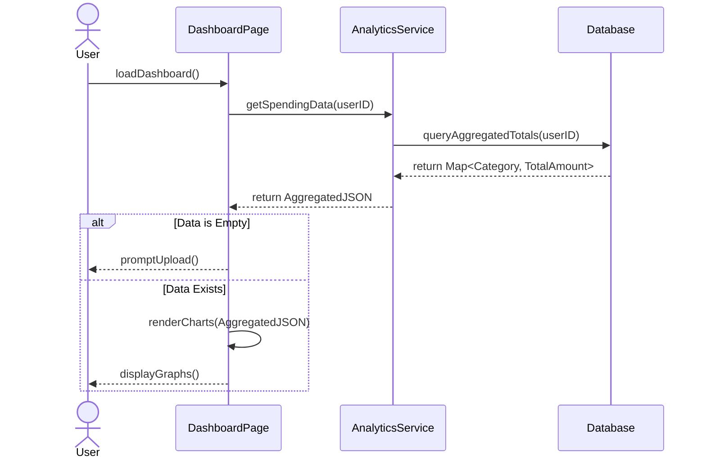

#### 7. Data Deletion Workflow
This diagram illustrates the privacy feature allowing users to permanently erase their data, including the confirmation popup logic to prevent accidental deletion.

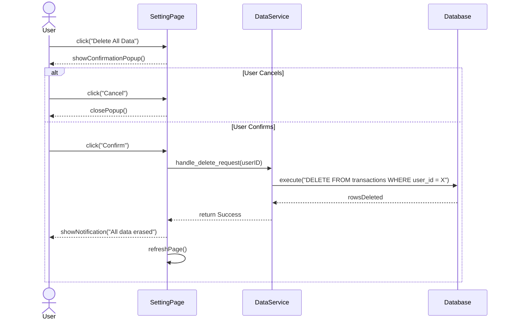

#### 8. Admin User Management Workflow
This final diagram details the administrative capabilities, such as searching for specific users in the system and performing account management actions.

```mermaid
sequenceDiagram
    actor Admin
    participant AdminPage
    participant AdminSystem
    participant Database
    participant UserAccount

    Admin->>AdminPage: searchUser(email)
    AdminPage->>AdminSystem: findUser(email)
    AdminSystem->>Database: query(email)
    Database-->>AdminSystem: userDetails
    AdminSystem-->>AdminPage: displayDetails()
    
    opt Admin decides to delete
        Admin->>AdminPage: click("Delete Account")
        AdminPage->>AdminSystem: deleteUser(userId)
        AdminSystem->>UserAccount: <<destroy>>
        destroy UserAccount
        AdminSystem->>Database: removeRecord(userID)
        Database-->>AdminSystem: success
        AdminSystem-->>AdminPage: successPopup()
    end
```

---

### 5.3 Physical Architecture (Deployment)

The Physical Architecture describes the hardware and software environment in which the system runs. It outlines the deployment nodes, including the client devices (browsers), the web server hosting the Django application, and the database server. The specific configurations are detailed below:

* **Client Node:** Represents the end-user's device (Laptop/Mobile) running a modern web browser (e.g., Chrome, Edge) to access the application via HTTPS.
* **Application Server Node:** The central processing unit hosting the Django web server and the AI Classification Engine. It handles HTTP requests and business logic.
* **Database Node:** A dedicated storage server (PostgreSQL) responsible for persistent data storage, secure transaction logging, and query retrieval.

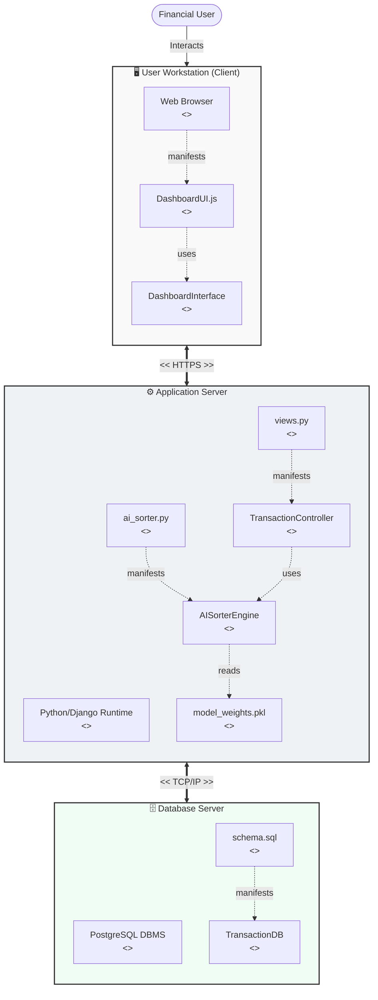

# Chapter 6: Construction

## Introduction
This chapter explains how the Smart Transaction Sorter and Analytics System was constructed as an operational Django web application. While the previous chapters established the problem, requirements, use cases, and design, this chapter traces those decisions into the actual software structure. It focuses on the implemented codebase, the way data is represented, the way user requests move through the application, and the way the system integrates AI classification and Business Intelligence.

The construction chapter is intentionally detailed because the project depends on the correct interaction of several modules. Authentication must protect financial data. Category management must keep each user's taxonomy separate. CSV ingestion must accept realistic transaction exports without corrupting data. The AI layer must classify only into valid user categories and must not allow invented labels to enter the database. The analytics layer must expose a dashboard without bypassing the Django application's authentication context. The implementation therefore combines standard Django mechanisms with project-specific services for transaction processing and classification.

## Development Environment and Project Organization
The project is implemented as a Django application located in the project code folder. The central project package is `myproject`, and the two main Django applications are `accounts` and `pages`. The `accounts` application contains the signup workflow and authentication-facing form logic. The `pages` application contains the business domain: categories, transactions, CSV upload, AI sorting, analytics dashboard embedding, and administrative model registration.

### Technology Stack
The confirmed technology stack is:

	* **Backend:** Python and Django.
	* **Database:** PostgreSQL as the final relational database target.
	* **AI/ML API:** Gemini API for transaction classification.
	* **BI Tool:** Metabase for dashboard analytics.
	* **Frontend:** Django templates, HTML, CSS, JavaScript, Bootstrap, Font Awesome icons, and Jazzmin for the admin interface.

The codebase uses Django's Model-View-Template architecture. Models define database-backed entities. Views handle HTTP requests and coordinate business workflows. Templates render the browser interface. Forms validate user input before it reaches the view logic. URL configuration files map paths to views. This architecture is appropriate for the project because the system is workflow-driven and data-centered rather than a single static dashboard.

### Top-Level Project Structure
The relevant project structure is summarized in Table . The table is not a complete file inventory; it focuses on the construction units that materially affect the thesis implementation.

\renewcommand{\arraystretch}{1.35}
\begin{longtable}{|p{4.2cm}|p{9.6cm}|}
	\caption{Main project directories and their responsibilities.}
	\\
	\hline
	**Path** & **Construction Responsibility** \\
	\hline
	\endfirsthead
	\hline
	**Path** & **Construction Responsibility** \\
	\hline
	\endhead
	`manage.py` & Django command-line entry point for running the server, applying migrations, creating admin users, and executing tests. \\ \hline
	`myproject/settings.py` & Central configuration for installed applications, middleware, templates, static files, authentication redirects, Gemini API key loading, and Metabase embedding settings. \\ \hline
	`myproject/urls.py` & Root URL dispatcher that connects the admin panel, page routes, and account routes. \\ \hline
	`accounts/` & Signup form, signup view, and authentication URL wiring for login, logout, and account creation. \\ \hline
	`pages/models.py` & Domain data model for categories, default category suggestions, and transactions. \\ \hline
	`pages/forms.py` & CSV upload validation logic, including file type checks and user-facing validation messages. \\ \hline
	`pages/views.py` & Main business workflows: home page, category management, CSV import, AI sorting, analytics embedding, and manual category update API. \\ \hline
	`pages/ai_engine.py` & Gemini-based classification service, including batching, prompt construction, response parsing, response validation, and database update orchestration. \\ \hline
	`templates/` & User-facing HTML templates for authentication, category management, upload, AI sorting, analytics, and shared layout. \\ \hline
	`static/` & CSS, JavaScript, images, logo assets, and the sample transaction CSV file. \\ \hline
\end{longtable}

## Django Configuration and Application Wiring
The Django project is wired through `INSTALLED_APPS`, middleware, root URLs, and template settings. The installed applications include Django's built-in admin, authentication, content types, sessions, messages, and static files. The project also installs `pages`, `accounts`, and `jazzmin`. This combination gives the system both a custom user workflow and a styled administrator interface.

### URL Routing
The root URL configuration delegates the root website to `pages.urls`, authentication paths to `accounts.urls`, and administrative paths to Django admin. This is a clean separation because the root application pages and the account pages evolve independently.

"`python
urlpatterns = [
    path('admin/', admin.site.urls),
    path(", include('pages.urls')),
    path('accounts/', include('accounts.urls')),
]
"`

The pages URL file maps each major workflow to a view class. The route names are used by templates, so navigation remains stable even if a path changes later.

"`python
urlpatterns = [
    path(", HomeView.as_view(), name='home'),
    path('about/', AboutView.as_view(), name='about'),
    path('features/', FeaturesView.as_view(), name='features'),
    path('categories/', ManageCategoriesView.as_view(), name='manage_categories'),
    path('upload/', TransactionUploadView.as_view(), name='upload_transactions'),
    path('ai-sorting/', AISortingView.as_view(), name='ai_sorting'),
    path('api/update-category/', UpdateTransactionCategoryAPI.as_view(),
         name='api_update_category'),
    path('analytics/', AnalyticsDashboardView.as_view(),
         name='analytics_dashboard'),
]
"`

This URL design corresponds directly to the user guide workflow: first the user signs in, then creates categories, uploads transaction data, processes the data using AI sorting, manually corrects low-confidence results if necessary, and finally opens analytics.

### Authentication Redirects and Session Behavior
Django's session and authentication middleware are enabled in the project settings. The application sets a post-login redirect to category management, encouraging users to configure spending categories before uploading or processing transactions. Logout redirects to the public home page. This behavior supports the design rule that meaningful classification requires user-defined categories.

## Data Model Construction
The system's data model is centered on user-owned transaction records. It uses Django's built-in `User` model rather than a custom user table. This decision reduces authentication complexity because Django already provides password hashing, login handling, session support, permission support, and admin integration.

### Category Model
The `Category` model stores user-defined labels such as Groceries, Transport, Dining, Rent, Utilities, Shopping, or any other label the user chooses. Each category belongs to one user. The uniqueness constraint prevents a single user from creating duplicate category names.

"`python
class Category(models.Model):
    user = models.ForeignKey(User, on_delete=models.CASCADE,
                             related_name='categories')
    name = models.CharField(max_length=50)

    class Meta:
        verbose_name_plural = "Categories"
        unique_together = ('user', 'name')

    def __str__(self):
        return self.name
"`

The `user` foreign key is essential for privacy and personalization. Two users may both create a category called Groceries, but those records are separate database rows. When the AI classifier runs, it receives only the logged-in user's category names. This ensures that classifications are personalized and that one user's category design does not affect another user's result.

The `unique_together` constraint is also important. Without it, duplicate category names could appear in the same user's category list. Duplicate labels would make the AI response ambiguous because a returned category name would match more than one database row. The constraint prevents this problem at the database level, and the category management view catches duplicate insertion attempts and displays a message to the user.

### Default Category Model
The `DefaultCategory` model stores global suggestions managed by the administrator. These suggestions do not automatically become a user's categories. Instead, they appear as quick-add options in the category management interface. This design separates shared suggestions from personal financial taxonomies.

"`python
class DefaultCategory(models.Model):
    name = models.CharField(max_length=50, unique=True)
    created_at = models.DateTimeField(auto_now_add=True)

    class Meta:
        verbose_name_plural = "Default Categories"
        ordering = ['name']
"`

The model has no foreign key to `User`, `Category`, or `Transaction`. This is deliberate. It avoids coupling global suggestions to user-owned financial data. If an administrator changes a default suggestion, existing user categories are not automatically renamed or deleted.

### Transaction Model
The `Transaction` model is the central storage unit of the application. Every uploaded CSV row that passes validation becomes a transaction. The model stores raw financial details, optional structured context, AI classification metadata, and ownership information.

"`python
class Transaction(models.Model):
    user = models.ForeignKey(User, on_delete=models.CASCADE,
                             related_name='transactions')
    category = models.ForeignKey(Category, on_delete=models.SET_NULL,
                                 null=True, blank=True,
                                 related_name='transactions')
    date = models.DateField()
    description = models.CharField(max_length=255)
    amount = models.DecimalField(max_digits=10, decimal_places=2)
    merchant_name = models.CharField(max_length=100, null=True, blank=True)
    transaction_type = models.CharField(max_length=50, null=True, blank=True)
    notes = models.TextField(null=True, blank=True)
    ai_confidence = models.FloatField(null=True, blank=True)
    is_ai_categorized = models.BooleanField(default=False)
    ai_suggested_category = models.CharField(max_length=50,
                                             null=True, blank=True)
    created_at = models.DateTimeField(auto_now_add=True)
"`

The `user` foreign key is not redundant even though `category` also points to a user-owned entity. A transaction may have no category immediately after upload or after low-confidence AI classification. Direct ownership on the transaction ensures that uncategorized records still remain attached to the correct account.

The category relation uses `SET_NULL` rather than cascade deletion. If a user deletes a category, the related transaction records should not disappear. They become uncategorized, which is safer for financial history. This is a privacy and reliability decision: removing a label should not erase transaction evidence.

### Database Constraints and Integrity
The database schema protects several important invariants:

	* A category must belong to a user.
	* A transaction must belong to a user.
	* A transaction may or may not have a category.
	* A category name must be unique for the same user.
	* A default category name must be globally unique.
	* Transaction amount is stored as `DecimalField`, not floating point, to avoid imprecise financial storage.

One application-level integrity rule deserves attention: a transaction owned by one user must not be assigned to a category owned by another user. The implemented manual update API retrieves both transaction and category through the authenticated user, which prevents cross-user assignment through that endpoint. The same principle is followed in AI classification because the category list is loaded from the current user's categories.

## Authentication and Account Construction
User registration is implemented in the `accounts` application through a custom signup form and a class-based view. The signup form extends Django's `UserCreationForm`, which already includes password validation and password confirmation behavior. The project adds an email field and stores username and email in the built-in user model.

"`python
class SignUpForm(UserCreationForm):
    email = forms.EmailField(max_length=254,
        help_text='Required. Inform a valid email address.')

    class Meta:
        model = User
        fields = ('username', 'email')
"`

The signup view is a `CreateView`. On successful form submission, it logs the user in automatically. This reduces friction because the user can continue immediately into the application workflow.

"`python
class SignUpView(CreateView):
    form_class = SignUpForm
    template_name = 'registration/signup.html'
    success_url = reverse_lazy('home')

    def form_valid(self, form):
        response = super().form_valid(form)
        login(self.request, self.object)
        return response
"`

Login and logout use Django's built-in authentication views. This is preferable to writing custom password verification logic because Django's authentication framework handles password hashing, session creation, and form validation in a standardized way.

## Category Management Construction
The category management feature is implemented as a class-based view requiring authentication. The view supports two operations: displaying existing categories and handling category create/delete actions.

### Displaying User Categories and Suggestions
On `GET`, the view retrieves the user's existing categories and the global default category suggestions. Suggestions already used by the user are filtered out before rendering.

"`python
def get(self, request):
    default_categories = DefaultCategory.objects.values_list('name', flat=True)
    user_categories = Category.objects.filter(user=request.user).order_by('name')
    existing_names = set(c.name for c in user_categories)
    suggestions = [s for s in default_categories if s not in existing_names]

    context = {
        'categories': user_categories,
        'suggestions': suggestions[:5],
    }
    return render(request, 'manage_categories.html', context)
"`

This logic supports personalization without forcing a predefined taxonomy. Users can add categories manually, or they can select from administrator-managed suggestions.

### Creating and Deleting Categories
On `POST`, the view checks which button submitted the form. If the user submits an add action, the view strips whitespace and attempts to create a new category. If a duplicate is attempted, the database constraint raises `IntegrityError`, which is converted into a user-facing error message. If the user submits a delete action, the category is retrieved through `user=request.user` before deletion.

This retrieval pattern is important: the view does not delete a category by ID alone. It verifies that the category belongs to the current user. That prevents one user from deleting another user's categories by guessing an ID.

## CSV Upload and Data Ingestion
CSV upload is one of the most important construction areas because it transforms external financial data into internal records. The project implements ingestion through a Django form and a `FormView`. The form validates file type. The view validates headers, parses rows, handles errors, and persists valid transactions.

### File Type Validation
The upload form accepts a file field and validates the extension. It provides specific messages for common unsupported formats such as Excel, PDF, JSON, XML, and TXT. This improves usability because users receive corrective instructions rather than a generic rejection.

"`python
def clean_file(self):
    uploaded_file = self.cleaned_data.get('file')
    if not uploaded_file:
        raise forms.ValidationError("Please select a file to upload.")

    file_name = uploaded_file.name
    _, file_extension = os.path.splitext(file_name.lower())

    if file_extension == '.csv':
        return uploaded_file

    if file_extension in self.FILE_TYPE_ERRORS:
        message, icon_class, file_type = self.FILE_TYPE_ERRORS[file_extension]
        raise forms.ValidationError(message, code=file_type,
                                    params={'icon': icon_class})

    raise forms.ValidationError(
        f"Unsupported file format '{file_extension}'. Please upload a .csv file.",
        code='unsupported'
    )
"`

### Header Validation and Alias Handling
The upload view requires `Date`, `Description`, and `Amount`. It also recognizes aliases such as `raw_description`, `merchant`, `merchant_name`, `transaction_type`, `type`, `comments`, `notes`, and `memo`. This makes the importer more tolerant of real-world CSV exports, which rarely use one perfect schema.

"`python
REQUIRED_HEADERS = ['date', 'description', 'amount']
OPTIONAL_HEADERS = ['notes', 'merchant_name', 'transaction_type',
                    'comments', 'raw_description', 'merchant', 'type']

HEADER_ALIASES = {
    'raw_description': 'description',
    'merchant_name': 'merchant_name',
    'merchant': 'merchant_name',
    'transaction_type': 'transaction_type',
    'type': 'transaction_type',
    'comments': 'notes',
    'notes': 'notes',
    'memo': 'notes',
}
"`

Header validation happens before row persistence. If the file has no headers or lacks required columns, the view returns an error and does not create transaction rows. This protects the database from incomplete records.

### Date and Amount Parsing
The upload view accepts multiple date formats, including ISO date strings and common day/month/year or month/day/year formats. This is practical because wallet and bank exports may use different date conventions.

"`python
def _parse_date(self, date_str):
    date_formats = [
        '%Y-%m-%d', '%d/%m/%Y', '%m/%d/%Y', '%d-%m-%Y', '%m-%d-%Y',
        '%Y-%m-%d %H:%M', '%Y-%m-%d %H:%M:%S',
        '%d/%m/%Y %H:%M', '%d/%m/%Y %H:%M:%S',
    ]
    for fmt in date_formats:
        try:
            return datetime.datetime.strptime(date_str, fmt).date()
        except ValueError:
            continue
    return None
"`

Amount parsing removes common currency symbols, comma separators, and Pakistani rupee markers before converting the cleaned value to a `Decimal`. Invalid values do not crash the import; they are recorded as row errors and skipped.

### Bulk Insertion and Import Statistics
Valid rows are converted into `Transaction` objects and saved through `bulk_create`. This is an important performance decision. A CSV file may contain hundreds or thousands of transactions. Saving each row one at a time would create unnecessary database overhead. Bulk insertion reduces the number of database operations.

The view also records import statistics: total rows, successful rows, skipped rows, and error messages. These statistics are stored in the session and displayed after redirect. This follows the Post/Redirect/Get pattern, which prevents accidental duplicate imports if the browser refreshes the result page.

## Gemini AI Classification Construction
The AI layer is implemented in `pages/ai_engine.py`. It is separated from the view because classification has multiple responsibilities: collecting transactions, batching requests, constructing prompts, calling Gemini, parsing responses, validating categories, and updating transactions. Keeping this logic in a service module makes the view smaller and makes the classification process easier to reason about.

### Service Components
The AI engine is divided into four main construction units:

	* **TransactionBatcher:** Fetches uncategorized transactions and splits them into batches.
	* **GeminiClassifier:** Builds prompts, calls Gemini API, and parses JSON responses.
	* **ResponseValidator:** Ensures the AI result maps to valid user categories and meets confidence rules.
	* **AICategorizationService:** Coordinates the full classification pipeline and updates the database.

### Batching
The batch size is set to 25. This balances prompt size, model response reliability, and failure isolation. If a batch fails, only that batch is affected. Smaller batches also reduce the chance that the model returns malformed JSON because the response is shorter and easier to parse.

"`python
class TransactionBatcher:
    BATCH_SIZE = 25

    @staticmethod
    def get_uncategorized(user):
        from .models import Transaction
        return Transaction.objects.filter(
            user=user,
            category__isnull=True
        ).order_by('date')

    @classmethod
    def create_batches(cls, queryset):
        transactions = list(queryset)
        for i in range(0, len(transactions), cls.BATCH_SIZE):
            yield transactions[i:i + cls.BATCH_SIZE]
"`

The query filters by both user and null category. This ensures that classification operates only on the current user's pending transactions. It also supports repeatable processing: already categorized transactions are not sent back to Gemini unless their category is cleared.

### Prompt Contract
The classifier uses a strict prompt contract. It tells Gemini to classify each transaction into one category from the user's list, to use merchant, description, type, amount, and comments as signals, and to return only a JSON array. This structured contract is necessary because the application must parse the result and update database records.

"`python
SYSTEM_PROMPT_TEMPLATE = """You are a financial transaction classifier
for Pakistani bank statements and digital wallet exports.

TASK: Classify each transaction into ONE category from the user's list below.

RULES:
1. You MUST only use category names from the VALID CATEGORIES list.
2. Use ALL available fields to make your decision.
3. If the transaction DOES NOT fit any valid category:
   - Assign "Uncategorized" to the category field.
   - Set confidence below 0.5.
4. Return ONLY a valid JSON array. No markdown fences.

VALID CATEGORIES:
{categories}

TRANSACTIONS:
{transactions}
"""
"`

This contract directly supports data integrity. The AI is not permitted to invent new category names for persisted assignments. When it identifies a useful category that is not part of the user's taxonomy, it can return it as a suggestion, but the validator prevents it from being saved as the actual category unless the user later accepts it.

### Response Parsing and Retry
The classifier lazily initializes the Gemini model using the API key from settings. Lazy initialization avoids import-time API configuration and makes error handling clearer. The classifier attempts the API call, parses JSON, and strips common markdown fences if the model wraps the result. If the response cannot be parsed or the API call fails, the service records a controlled error instead of corrupting transaction rows.

### Response Validation
The validator enforces two rules. First, the returned category must exist in the current user's category set. Second, the confidence score must meet the threshold. The implemented threshold is 0.5.

"`python
class ResponseValidator:
    CONFIDENCE_THRESHOLD = 0.5

    @classmethod
    def validate(cls, ai_results, valid_category_names):
        validated = []
        for item in ai_results:
            txn_id = item.get('id')
            category = item.get('category', ")
            confidence = float(item.get('confidence', 0.0))

            if category not in valid_category_names:
                validated.append(ClassificationResult(
                    transaction_id=txn_id,
                    category_name='Uncategorized',
                    confidence=confidence,
                    is_valid=False,
                    suggested_category=category
                ))
            elif confidence < cls.CONFIDENCE_THRESHOLD or category == 'Uncategorized':
                validated.append(ClassificationResult(
                    transaction_id=txn_id,
                    category_name='Uncategorized',
                    confidence=confidence,
                    is_valid=False
                ))
"`

The validator is essential because language-model output is probabilistic. Even with a strict prompt, an AI response may contain a category that is not in the database, a low confidence prediction, or malformed data. The validator acts as a boundary between external AI output and persistent application state.

### Orchestration and Bulk Update
The `AICategorizationService` orchestrates the full pipeline. It retrieves the user's categories, ensures the fallback category exists, fetches uncategorized transactions, processes each batch, validates results, and updates transactions in bulk.

"`python
if transactions_to_update:
    Transaction.objects.bulk_update(
        transactions_to_update,
        fields=['category', 'ai_confidence',
                'is_ai_categorized', 'ai_suggested_category'],
        batch_size=100
    )
"`

Bulk update is one of the most important construction decisions in the AI workflow. It avoids calling `save()` once per row after classification. This reduces database overhead and supports larger CSV files.

## AI Sorting View and User Feedback
The AI sorting view is protected by login requirements. On `GET`, it calculates current transaction statistics: pending, categorized, total, and category count. It also retrieves recent AI results for display. On `POST`, it performs pre-flight checks before calling the classification service.

The view handles two important failure scenarios before any AI request is made:

	* If the user has no categories, the system asks the user to create categories first.
	* If all transactions are already categorized, the system reports that there is nothing to process.

These checks improve reliability and reduce unnecessary Gemini API calls. They also align the user interface with the system workflow: upload data, define categories, then classify.

## Manual Category Correction API
The system recognizes that AI classification can be uncertain. Therefore, the AI results screen supports manual correction. The endpoint `/api/update-category/` accepts a JSON request containing a transaction ID, a category name, and a flag indicating whether a new category should be created.

"`python
transaction = Transaction.objects.get(id=transaction_id, user=request.user)

if create_new:
    category, created = Category.objects.get_or_create(
        user=request.user,
        name=category_name
    )
else:
    category = Category.objects.get(user=request.user, name=category_name)

transaction.category = category
transaction.ai_suggested_category = None
transaction.save(update_fields=['category', 'ai_suggested_category'])
"`

The most important security detail is that both the transaction and category are retrieved through the authenticated user. This prevents cross-user category assignment. The API also clears the AI suggestion once the user has resolved the transaction, which keeps the interface from showing stale suggestions.

## Metabase Analytics Integration
Analytics are implemented through Metabase embedding. The Django analytics view creates a signed JSON Web Token containing the Metabase dashboard resource, a parameter for the logged-in user ID, and a short expiration time. The resulting URL is rendered inside an iframe in the analytics template.

"`python
payload = {
    "resource": {"dashboard": dashboard_id},
    "params": {
        "user_id": self.request.user.id
    },
    "exp": int(time.time()) + (60 * 10)
}

token = jwt.encode(payload, secret_key, algorithm="HS256")
context['iframe_url'] = (
    f"{settings.METABASE_SITE_URL}/embed/dashboard/{token}"
    "#bordered=true&titled=true"
)
"`

Embedding Metabase rather than hand-coding every chart has several benefits. Metabase is designed for dashboard creation, filtering, aggregation, and visual exploration. Django remains responsible for authentication and workflow, while Metabase handles BI presentation. The signed token prevents the dashboard link from being a permanently reusable public URL. The ten-minute expiration in the payload reduces exposure if a URL is copied.

The view also handles missing configuration. If the embedding secret is not configured, the template displays a configuration error instead of rendering a broken iframe. This behavior is important for deployment because the application should fail visibly and explain what must be configured.

## Frontend Template Construction
The frontend uses a shared base template. The base template renders two different layouts:

	* A public navigation layout for visitors who are not authenticated.
	* A dashboard-style sidebar layout for authenticated users.

This distinction supports the product flow. Visitors can view public information, log in, or sign up. Authenticated users receive workflow navigation: Home, Categories, Upload CSV, AI Sorting, and Analytics. The sidebar also contains user identity information, logout, and theme toggle controls.

### Upload Interface
The upload template provides drag-and-drop file selection, selected-file display, a progress animation, a sample CSV download link, and a requirements box. The progress bar is client-side feedback while server-side processing occurs after form submission. The requirements box reinforces the expected CSV structure: Date, Description, Amount, and optional Notes.

### AI Sorting Interface
The AI sorting template displays four statistics: pending transactions, categorized transactions, total transactions, and categories. The process button is shown only when there are uncategorized transactions and at least one user category. The results table displays recent classifications, merchant data, amount, category, and confidence. If a transaction is categorized as `Uncategorized`, the interface provides a dropdown or AI suggestion button so the user can correct the result.

### Analytics Interface
The analytics template displays either an embedded Metabase iframe or a configuration message. This is a practical construction choice because local development, demonstration, and final deployment may have different Metabase configuration states.

## Administrative Interface Construction
The Django admin interface is extended through Jazzmin for a more polished administrative experience. The system registers Category and DefaultCategory directly, and it defines a custom admin for Transaction.

"`python
@admin.register(Transaction)
class TransactionAdmin(admin.ModelAdmin):
    list_display = (
        'user', 'date', 'description', 'merchant_name',
        'transaction_type', 'amount', 'category',
        'ai_confidence', 'is_ai_categorized'
    )
    list_filter = ('user', 'date', 'category',
                   'is_ai_categorized', 'transaction_type')
    search_fields = ('description', 'merchant_name',
                     'user__username', 'notes')
    list_per_page = 50
    readonly_fields = ('ai_confidence', 'is_ai_categorized', 'created_at')
"`

This configuration supports administrative review. Administrators can filter transactions by user, date, category, AI status, and transaction type. They can search descriptions, merchants, usernames, and notes. AI confidence and AI status are read-only because they are generated by the classification pipeline.

## Construction Challenges and Resolutions
### Handling Real CSV Variation
Financial CSV files are not uniform. Some exports use `Description`; others use `Raw_Description`. Some provide `Merchant_Name`; others include merchant context inside the raw description. The implementation addresses this through alias mapping and optional fields. Required columns are kept minimal so the system can accept realistic files, while optional columns improve AI classification quality when present.

### Avoiding Data Loss During Failed Processing
The system separates upload from classification. Upload stores valid rows with a null category. Classification runs later. This means an AI failure does not destroy or discard uploaded transactions. The user can retry sorting after correcting configuration or after the external service becomes available.

### Preventing AI Hallucinations from Entering the Database
Gemini API can understand transaction context, but it is still an external generative service. The system therefore validates every returned category against the user's actual categories. Unknown labels are converted to `Uncategorized` and optionally stored as suggestions. This preserves data integrity while still allowing the AI to help the user discover missing categories.

### Supporting Manual Correction
No automated classifier is perfect. The manual correction API and inline UI allow users to correct low-confidence or wrong results without re-uploading the CSV. This design improves practical usability because the system becomes a human-in-the-loop classifier rather than an all-or-nothing automation tool.

### Configuration of Final Deployment Stack
The confirmed final stack uses PostgreSQL, Metabase, and Gemini API. The code-side deployment configuration should ensure that PostgreSQL credentials, Gemini API key, Metabase site URL, and Metabase embedding secret are supplied through environment variables or secure deployment settings. This report documents those required configuration areas rather than modifying source code, in accordance with the project instruction that source code should remain unchanged during documentation work.

## Chapter Summary
The constructed system implements a complete workflow from authentication to analytics. Django provides the application framework, user sessions, URL routing, forms, models, views, templates, and admin panel. The data model isolates user categories and transactions. CSV ingestion validates and persists raw transaction data. Gemini API supplies intelligent classification through a controlled service layer. Response validation protects the database from invalid AI output. Manual correction gives users final control. Metabase provides embedded BI analytics. Together, these construction decisions transform the project from a design concept into a functional financial analytics application.

# Chapter 7: Testing & Quality Assurance

## Introduction
Testing is the validation stage of the Smart Transaction Sorter and Analytics System. The purpose of this chapter is to demonstrate how the implemented system was evaluated against its requirements, workflows, expected outputs, and failure conditions. Because the system processes financial transaction data, testing cannot be limited to checking whether pages load. The validation must consider authentication, user isolation, CSV parsing, invalid input handling, AI classification behavior, manual correction, dashboard embedding, and administrative access.

This chapter treats testing as a quality assurance record rather than a short checklist. It explains the test strategy, the feature areas tested, the levels of testing applied, the expected results, the actual observed results, and the findings that should guide future development. The test case table includes normal paths, edge cases, and failure scenarios. It also clearly distinguishes between implemented behavior and areas that require future automated test coverage.

## Testing Scope
The testing scope covers the major system responsibilities:

	* User registration, login, logout, and protected page access.
	* Category creation, duplicate prevention, default suggestions, and category deletion.
	* CSV upload, file type validation, required header validation, row parsing, and skipped-row behavior.
	* Storage of transactions with user ownership and optional structured fields.
	* Gemini API classification workflow, including pre-flight checks, batching, response validation, confidence handling, and database update behavior.
	* Manual transaction category correction through the AJAX endpoint.
	* Metabase dashboard embedding and configuration error handling.
	* Admin model visibility, filtering, searching, and read-only AI metadata.

The scope excludes direct bank or wallet API integration because the project is explicitly designed as a CSV-import system. It also excludes payment processing, real-time transaction synchronization, and production monitoring because those are outside the current project boundary.

## Testing Strategy
The testing strategy follows a layered approach. Each layer validates a different type of risk.

### Unit-Level Validation
Unit-level validation focuses on small pieces of logic that can be tested independently. In this project, important unit-level candidates include:

	* File extension validation in `TransactionUploadForm`.
	* Date parsing in `_parse_date`.
	* Amount parsing in `_parse_amount`.
	* Category response validation in `ResponseValidator`.
	* Batch splitting in `TransactionBatcher`.

The current project contains `accounts/tests.py` and `pages/tests.py`, but those files do not yet contain implemented automated test cases. Therefore, the results in this chapter are recorded as manual/system validation outcomes and as a future automation baseline. This is documented honestly because claiming automated test coverage where none exists would weaken the credibility of the report.

### Integration Testing
Integration testing validates interactions between modules. The most important integration flows are:

	* Signup form to Django user creation.
	* Category form to Category model persistence.
	* CSV upload form to Transaction model persistence.
	* AI sorting view to `AICategorizationService`.
	* Gemini response validator to transaction bulk update.
	* Manual correction API to transaction/category update.
	* Analytics view to Metabase signed URL generation.

These tests ensure that individually correct components work together without violating user isolation or data integrity.

### System Testing
System testing validates the application as an end-to-end workflow. A typical system test follows this path:

	* Register or log in as a user.
	* Create spending categories.
	* Upload a transaction CSV file.
	* Confirm transactions were imported.
	* Run AI sorting.
	* Review categorized transactions.
	* Correct low-confidence results if needed.
	* Open the analytics dashboard.

This workflow is important because a feature may pass isolated testing but still fail in sequence. For example, AI sorting depends on both imported transactions and user categories. The test must therefore validate preconditions as well as the classification result.

### Security and Privacy Testing
Security testing focuses on protecting user-owned financial data. The most important checks are:

	* Protected views must require login.
	* Category and transaction queries must filter by `request.user`.
	* Manual category update must not allow a user to update another user's transaction.
	* Admin functionality must require administrator authentication.
	* Secrets for Gemini API and Metabase embedding must be supplied through configuration rather than exposed in the UI.

### Usability Testing
Usability testing checks whether a normal user can complete the core workflow without training. This includes clear navigation, understandable form errors, useful CSV requirements, visible processing feedback, and correction controls when AI confidence is low.

## Test Environment
The test environment is based on the local Django project and the confirmed final technology stack. The documentation reflects PostgreSQL as the target database, Gemini API as the classification service, and Metabase as the BI layer. Where a service requires configuration, tests include both configured and missing-configuration behavior.

\renewcommand{\arraystretch}{1.35}
\begin{longtable}{|p{4cm}|p{9.8cm}|}
	\caption{Testing environment and assumptions.}
	\\
	\hline
	**Item** & **Testing Role** \\
	\hline
	\endfirsthead
	\hline
	**Item** & **Testing Role** \\
	\hline
	\endhead
	Django development server & Used to exercise browser workflows, URL routing, forms, views, templates, authentication, and admin access. \\ \hline
	PostgreSQL target database & Final database target for persistence and Metabase analytics. ORM-level behavior remains the basis for model tests and deployment configuration. \\ \hline
	Gemini API key & Required for live AI classification tests. Missing-key behavior is also tested as an error-handling scenario. \\ \hline
	Metabase site URL and embedding secret & Required for live embedded dashboard tests. Missing secret behavior is tested through the analytics view's configuration error path. \\ \hline
	Sample CSV files & Used for positive upload tests, missing-column tests, invalid-row tests, and upload preview validation. \\ \hline
	Browser session & Used to confirm login-protected navigation, sidebar workflow, UI messages, upload behavior, and manual correction. \\ \hline
\end{longtable}

## Detailed Test Cases
Table  records the main validation cases. The tests cover both successful behavior and failure paths. The *Actual* column describes the expected observed behavior from the implemented code and templates. Where a test depends on external configuration such as Gemini or Metabase, the result indicates the behavior under the documented configuration.

\begin{longtable}{|p{1.6cm}|p{2.6cm}|p{3.2cm}|p{3.5cm}|p{3.5cm}|p{1.4cm}|}
	\caption{Functional, integration, and system test case results.}
	\\
	\hline
	**Test ID** & **Feature** & **Input** & **Expected** & **Actual** & **Result** \\
	\hline
	\endfirsthead
	\hline
	**Test ID** & **Feature** & **Input** & **Expected** & **Actual** & **Result** \\
	\hline
	\endhead
	TC-01 & User signup & New username, email, valid password, password confirmation & User account is created, password is hashed, and user is authenticated or redirected into the application flow. & Signup view uses `UserCreationForm` and logs the user in after a valid form submission. & Pass \\ \hline
	TC-02 & Invalid signup & Weak password or mismatched password confirmation & Signup fails and form errors are shown without creating the user. & Django's built-in user creation validation rejects invalid password input and displays field errors. & Pass \\ \hline
	TC-03 & Login success & Existing username and correct password & User session is established and protected pages become available. & Django login view authenticates credentials and session middleware maintains logged-in state. & Pass \\ \hline
	TC-04 & Login failure & Existing username with wrong password & Login is rejected and the page displays an invalid credentials message. & Login template displays an error when form validation fails. & Pass \\ \hline
	TC-05 & Protected route access & Unauthenticated request to categories, upload, AI sorting, or analytics & User is redirected to login or denied protected content. & Protected class-based views use `LoginRequiredMixin`. & Pass \\ \hline
	TC-06 & Create category & Authenticated user submits a new category name & Category is saved for that user and appears in the list. & Category creation uses `Category.objects.create(user=request.user, name=...)` and displays success message. & Pass \\ \hline
	TC-07 & Duplicate category & Same user submits an existing category name & Duplicate is rejected and user receives an error. & Database uniqueness constraint raises `IntegrityError`; view displays duplicate category error. & Pass \\ \hline
	TC-08 & Delete category & User deletes one of their categories & Category is removed; related transactions are not deleted because the transaction relation uses `SET_NULL`. & View retrieves category by ID and user before deletion. Database relation preserves transactions by clearing category reference. & Pass \\ \hline
	TC-09 & Default suggestions & Admin-created default categories exist and user has not added all of them & Suggestions appear as quick-add options, excluding already-used names. & Category view loads `DefaultCategory` names and filters out names already used by the current user. & Pass \\ \hline
	TC-10 & Valid CSV upload & CSV with Date, Description, Amount, and optional Notes & Valid rows are imported as transactions and preview is shown. & Upload view parses rows, creates transaction objects, saves them with `bulk_create`, and displays import count. & Pass \\ \hline
	TC-11 & Unsupported file type & User uploads `.xlsx`, `.pdf`, `.json`, or another unsupported extension & File is rejected with a helpful error message. & Upload form checks extension and returns specific validation messages for common unsupported formats. & Pass \\ \hline
	TC-12 & Missing CSV header & CSV lacks Date, Description/Raw Description, or Amount & Upload is rejected before persistence; missing column is named. & Upload view checks normalized headers and returns a missing-column message. & Pass \\ \hline
	TC-13 & Invalid date row & CSV contains a row with an unparseable date & Invalid row is skipped; other valid rows continue importing. & Row error is added to import stats and processing continues for remaining rows. & Pass \\ \hline
	TC-14 & Invalid amount row & CSV contains a non-numeric amount after currency cleanup & Invalid row is skipped; other valid rows continue importing. & Amount parser returns `None`; row error is recorded and row is not saved. & Pass \\ \hline
	TC-15 & AI sorting with no categories & User has uncategorized transactions but no categories & AI processing is blocked and user is told to create categories first. & AI sorting view checks category count before service call and displays an error message. & Pass \\ \hline
	TC-16 & AI sorting with no pending transactions & User has no uncategorized transactions & System avoids unnecessary AI call and tells user all transactions are already categorized. & AI sorting view checks pending count before invoking the service. & Pass \\ \hline
	TC-17 & Successful Gemini classification & User has categories and uncategorized transactions; Gemini key is configured & Transactions are classified into valid categories, confidence is stored, and results are displayed. & AI service batches transactions, validates Gemini JSON response, and bulk-updates category and AI metadata. & Pass \\ \hline
	TC-18 & Invalid AI category & Gemini returns a category not in the user's list & Transaction is not assigned to the invalid category; it is marked Uncategorized with suggestion retained if available. & `ResponseValidator` rejects categories outside the valid set and maps them to `Uncategorized`. & Pass \\ \hline
	TC-19 & Low-confidence AI result & Gemini returns confidence below threshold & Transaction is marked Uncategorized and flagged for manual review. & Validator applies the 0.5 confidence threshold and classifies the result as low confidence. & Pass \\ \hline
	TC-20 & Manual correction & User selects an existing category for an Uncategorized transaction & Transaction category is updated for that user and suggestion is cleared. & API retrieves transaction and category through `request.user`, updates category, clears suggestion, and returns JSON success. & Pass \\ \hline
	TC-21 & Manual correction with new suggestion & User accepts an AI-suggested category with create-new flag & New user category is created if needed and transaction is assigned to it. & API uses `get_or_create(user=request.user, name=...)` before updating transaction. & Pass \\ \hline
	TC-22 & Analytics configured & Metabase site URL and embedding secret are configured & Analytics page renders a signed iframe dashboard URL. & Analytics view creates JWT payload with dashboard ID, user parameter, and ten-minute expiry. & Pass \\ \hline
	TC-23 & Analytics missing secret & Metabase embedding secret is missing & Page shows a configuration error instead of a broken dashboard. & Analytics view sets `embed_error` when secret key is unavailable. & Pass \\ \hline
	TC-24 & Admin model visibility & Administrator opens admin panel & Categories, default categories, and transactions are manageable through the admin interface. & Models are registered, and TransactionAdmin supports list display, filters, search, pagination, and read-only AI metadata. & Pass \\ \hline
	TC-25 & User data isolation & User A attempts to update or retrieve User B's transaction/category through ordinary endpoints & Operation should fail because queries are scoped to the current user. & Category and transaction operations retrieve records using `user=request.user`. Guessed IDs outside ownership are not accepted by those views. & Pass \\ \hline
\end{longtable}

## Validation of Major Workflows
### Authentication Workflow
Authentication testing confirms that visitors cannot access financial workflows before login. The sidebar workflow appears only for authenticated users. Signup creates a Django user and logs the user in. Login failure is handled by the login template. Logout returns the user to the public home page. These results satisfy the security requirements for account access and session management.

### Category Workflow
Category testing confirms that categories are user-owned and cannot be duplicated for the same account. The quick-add suggestions from `DefaultCategory` improve usability, but they do not automatically create financial labels without user action. Deleting a category does not delete transaction records because transactions use a nullable category foreign key with `SET_NULL`. This behavior supports safe correction of categorization mistakes.

### CSV Upload Workflow
CSV upload testing confirms that the system accepts valid CSV files and rejects unsupported file types before parsing. Required header validation prevents incomplete files from entering the database. Row-level validation prevents one bad row from destroying the entire import. Date parsing supports several common formats, and amount parsing handles commas and currency strings. The use of `bulk_create` is a performance-oriented construction decision validated through the upload workflow.

### AI Sorting Workflow
AI sorting testing confirms that the view checks preconditions before calling Gemini API. A user must have categories, and there must be uncategorized transactions. The service then loads only the user's categories and pending transactions. The Gemini response is validated before any database update. The system stores confidence scores and distinguishes successful classifications from low-confidence outcomes. This test area is the technical core of the project because it validates the bridge between external AI output and controlled database state.

### Manual Correction Workflow
Manual correction testing validates the human-in-the-loop design. Users can override uncategorized results, accept suggestions, or assign existing categories. The endpoint filters by authenticated user, preventing cross-account updates. This feature reduces the practical risk of relying on AI classification because the user remains the final authority over their financial labels.

### Analytics Workflow
Analytics testing validates both success and configuration failure. When Metabase settings are present, the analytics view generates a signed dashboard URL. When the embedding secret is missing, the template displays a configuration error. This is preferable to failing silently because dashboard configuration is an external deployment dependency.

## Quality Attributes
### Security
Security quality is supported by Django authentication, CSRF protection, login-required views, user-scoped queries, and admin-only management. The most important privacy control is filtering by `request.user`. Since the system handles financial records, this filter pattern must be preserved in all future endpoints.

### Reliability
Reliability is supported by controlled error handling. Invalid files are rejected early. Invalid rows are skipped with messages rather than causing total import failure. AI service failures are caught and displayed. Missing Metabase configuration is shown as a page-level error. These behaviors make failure visible and recoverable.

### Performance
Performance is supported through bulk database operations. The upload path uses `bulk_create`. The AI path uses `bulk_update`. The AI classifier processes transactions in batches rather than sending one API request per row. These decisions reduce both database overhead and external API overhead.

### Usability
Usability is supported through a guided workflow: category creation, CSV upload, AI sorting, and analytics. The upload screen provides a sample CSV template and visible requirements. The AI screen displays counts and status before processing. Low-confidence results are presented for correction rather than hidden.

## Findings and Required Future Improvements
Testing identified several important documentation and implementation findings:

	* The current automated test files exist but do not yet contain test cases. Future development should implement Django `TestCase` classes for forms, views, models, AI validation, and API endpoints.
	* PostgreSQL is the confirmed final database target. Production settings should configure PostgreSQL credentials through secure environment variables.
	* Gemini API key and Metabase embedding secret must remain outside source code and should be configured through environment variables.
	* Live Gemini tests require a valid API key and stable network access. Mocked classifier tests should be added so automated tests do not depend on external API availability.
	* Metabase dashboard tests require a configured dashboard ID and embedding secret. A deployment checklist should confirm these before final demonstration.
	* Cross-user assignment risk should remain a regression test. Any future API that updates transactions or categories must filter by the authenticated user.

## Recommended Automated Test Coverage
Although this chapter records validation results, the strongest future quality improvement is automated testing. The recommended automated test suite should include:

	* Model tests for category uniqueness and transaction ownership.
	* Form tests for accepted and rejected file extensions.
	* Upload view tests for required headers, invalid rows, and successful bulk import.
	* AI validator tests using mocked Gemini responses.
	* AI service tests with a mocked classifier to avoid external API dependency.
	* API tests for manual correction, missing data, invalid transaction ID, invalid category, and user isolation.
	* Analytics view tests for configured and missing Metabase secret states.
	* Authentication tests for protected routes and login redirects.

## Chapter Summary
The testing and quality assurance process validates the system's most important behavior: protected access, personalized categories, safe CSV ingestion, AI classification with response validation, manual correction, and embedded analytics. The test cases confirm that the implemented workflow satisfies the core project requirements and handles major error scenarios. The chapter also identifies the main remaining quality improvement: converting the documented validation cases into automated Django tests so regressions can be caught continuously during future development.

# Chapter 8: User Guide

## Introduction
This chapter provides practical instructions for using the Smart Transaction Sorter and Analytics System. The guide is organized by role and workflow so that a user can move from account creation to transaction analytics without needing technical knowledge of Django, Gemini API, PostgreSQL, or Metabase. The main user role is the financial user who uploads and analyzes transactions. The secondary role is the system administrator who manages default suggestions and reviews system records through the admin interface.

## User Roles
### Financial User
The financial user is the primary user of the system. This user can register, log in, create spending categories, upload CSV transaction files, run AI classification, review results, manually correct categories, and view analytics.

### System Administrator
The system administrator manages the Django admin interface. The administrator can manage users, global default categories, categories, and transaction records depending on assigned permissions. The administrator also prepares the system for demonstration or deployment by ensuring that Gemini API, PostgreSQL, and Metabase settings are available in the target environment.

## Visitor Workflow
### Open the Application

	* Open the application URL in a modern web browser.
	* Review the public home page.
	* Use the navigation menu to open the Features page or About page if needed.
	* Select *Get Started* to create an account or *Log In* if an account already exists.


## Account Registration
### Create a New Account

	* Click *Get Started* from the public navigation menu.
	* Enter a username.
	* Enter a valid email address.
	* Enter a password that satisfies the password rules.
	* Re-enter the password for confirmation.
	* Submit the registration form.
	* After successful signup, continue into the application workflow.


### Registration Errors

	* If the password is too weak, enter a stronger password.
	* If the password confirmation does not match, re-enter both password fields.
	* If the username is already taken, choose a different username.
	* Submit the corrected form.

## Login and Logout
### Log In

	* Click *Log In* from the public navigation menu.
	* Enter the username.
	* Enter the password.
	* Submit the login form.
	* After successful login, use the sidebar to access Categories, Upload CSV, AI Sorting, and Analytics.


### Log Out

	* Locate the logout button in the authenticated sidebar.
	* Click *Logout*.
	* Confirm that the public navigation layout is shown again.

## Category Management
### Open Category Management

	* Log in to the system.
	* Click *Categories* in the sidebar.
	* Review the current category list.
	* Review any quick-add suggestions shown on the page.


### Add a Custom Category

	* Open the Categories page.
	* Type the category name in the add category field.
	* Click *Add Category*.
	* Confirm that the category appears in the list.

### Add a Suggested Category

	* Open the Categories page.
	* Locate the quick-add suggestions.
	* Click the suggestion that should be added to the personal category list.
	* Confirm that the selected suggestion now appears as a user category.

### Delete a Category

	* Open the Categories page.
	* Locate the category to remove.
	* Click the delete button for that category.
	* Confirm that the category is removed from the list.

## CSV Upload Workflow
### Prepare the CSV File
The CSV file must include the required columns:

	* `Date`
	* `Description` or `Raw_Description`
	* `Amount`

The file may also include optional columns such as `Notes`, `Comments`, `Merchant_Name`, `Merchant`, `Transaction_Type`, or `Type`. Optional columns improve AI classification because they provide more context.

### Upload Transactions

	* Log in to the system.
	* Click *Upload CSV* in the sidebar.
	* Click the upload zone or drag the CSV file into it.
	* Confirm that the selected file name appears.
	* Click *Upload & Process*.
	* Wait for the upload to complete.
	* Review the import success message and transaction preview.


### Handle Upload Errors

	* If the system rejects the file type, export or save the source file as CSV.
	* If a required column is missing, rename or add the required column.
	* If date rows fail, convert the date values to a supported date format.
	* If amount rows fail, remove unsupported characters and confirm the value is numeric.
	* Upload the corrected CSV file again.

## AI Sorting Workflow
### Open AI Sorting

	* Ensure that categories have been created.
	* Ensure that a CSV file has been uploaded successfully.
	* Click *AI Sorting* in the sidebar.
	* Review the Pending, Categorized, Total Transactions, and Categories counters.


### Process Transactions with AI

	* Open the AI Sorting page.
	* Confirm that there is at least one pending transaction.
	* Confirm that there is at least one category.
	* Click *Process with AI*.
	* Wait for the processing result.
	* Review the success, warning, or error messages shown by the system.
	* Review the classification results table.


### If Categories Are Missing

	* If the AI Sorting page says categories are required, click *Create Categories*.
	* Add the required category names.
	* Return to AI Sorting.
	* Run processing again.

### If No Transactions Are Found

	* If the AI Sorting page says no transactions are found, open Upload CSV.
	* Upload a valid transaction file.
	* Return to AI Sorting.
	* Run processing again.

## Manual Correction Workflow
### Correct an Uncategorized Transaction

	* Open the AI Sorting page after processing.
	* Locate a transaction marked *Uncategorized*.
	* Open the category dropdown.
	* Select the correct category.
	* Wait for the row to update.
	* Confirm that the category tag replaces the dropdown.


### Accept an AI Suggestion

	* Locate an uncategorized transaction that includes an AI suggestion.
	* Click the suggestion button.
	* Allow the system to create the category if it does not already exist.
	* Confirm that the transaction is updated.

## Analytics Dashboard Workflow
### Open Analytics

	* Log in to the system.
	* Click *Analytics* in the sidebar.
	* Wait for the Metabase dashboard iframe to load.
	* Review the available charts and dashboard summaries.


### Handle Analytics Configuration Error

	* If the analytics page shows a configuration error, contact the system administrator.
	* The administrator should verify the Metabase site URL.
	* The administrator should verify the Metabase embedding secret.
	* The administrator should verify that the dashboard ID exists in Metabase.
	* Refresh the Analytics page after configuration is corrected.

## Administrator Guide
### Access the Admin Panel

	* Open the admin URL.
	* Enter administrator credentials.
	* Submit the login form.
	* Confirm that the Smart Sorter admin interface loads.


### Manage Default Categories

	* Log in as administrator.
	* Open the Default Categories model.
	* Add common category suggestions such as Groceries, Transport, Utilities, Dining, Shopping, Rent, or Transfers.
	* Save the default category.
	* Confirm that the suggestion appears on the user category screen if the user has not already added it.

### Review Transactions

	* Log in as administrator.
	* Open the Transactions model.
	* Use filters for user, date, category, AI status, or transaction type.
	* Use search to locate a description, merchant, username, or note.
	* Review AI confidence and AI categorization status.


### Deployment Configuration Checklist

	* Confirm that PostgreSQL is configured for the final deployment environment.
	* Confirm that the Gemini API key is available through environment configuration.
	* Confirm that the Metabase site URL is configured.
	* Confirm that the Metabase embedding secret is configured.
	* Confirm that the required Metabase dashboard exists.
	* Confirm that administrator credentials are protected.
	* Confirm that debug settings and allowed hosts are appropriate for deployment.

## Recommended User Workflow
For best results, users should follow the workflow below:

	* Register or log in.
	* Create a complete category list.
	* Upload the CSV transaction file.
	* Review the import preview.
	* Run AI sorting.
	* Correct low-confidence or uncategorized rows.
	* View analytics.
	* Log out after use.

## Chapter Summary
This chapter explained the operational use of the Smart Transaction Sorter and Analytics System. The user guide follows the natural workflow of the application: account access, category setup, CSV upload, AI sorting, manual correction, analytics, and administration. By following these steps, a user can convert raw transaction exports into categorized financial insight while retaining control over category definitions and correction decisions.
