# Smart Transaction Sorter & Analytics System
**Final Year Project (Phase-I) Documentation**

**Developed By:**
* Rida Eman (BS CS Aut-22-M-A-0039)
* Muhammad Mahhin Shahzad (BS CS Aut-22-M-A-0030)

**Supervised By:**
* Mr. Naeem Akhter Malik (Lecturer, Department of Computer Science)

**Institution:**
* Federal Urdu University of Arts, Science and Technology, Islamabad
* Session [2022-2026]

---

## Project in Brief

| Attribute | Details |
| :--- | :--- |
| **Project Title** | Smart Transaction Sorter & Analytics System |
| **Organization** | Federal Urdu University of Arts, Science and Technology |
| **Objectives** | • Develop an independent web platform to ingest raw, unstructured CSV transaction exports from local digital wallets.<br>• Utilize a Large Language Model (LLM) to automatically categorize messy transaction descriptions into user-defined labels.<br>• Generate interactive Business Intelligence (BI) dashboards to visualize spending patterns without manual data entry.<br>• Deliver a proof-of-concept demonstrating how AI can solve the analytics gap in the Pakistani fintech market. |
| **Undertaken By** | Rida Eman, Muhammad Mahhin Shahzad |
| **Supervised By** | Mr. Naeem Akhter Malik |
| **Date Started** | 2nd October, 2025 |
| **Date Completed** | 28th June, 2026 |
| **Technologies Used** | Python, Django Framework, PostgreSQL, Pandas, Gemini 1.5 API, Hugging Face Transformers, Metabase, Plotly.js, Tailwind CSS, JavaScript, HTML5 |
| **System Used** | 12th Gen Intel Core i5 Processor, 16 GB RAM, 256 SSD |

---

## Abstract

The fast-paced rise of digital commerce in Pakistan has resulted in an increasing number of individuals utilizing various fintech applications. However, the lack of adequate analytics tools makes it difficult for individuals to extract useful information from their transactions. In Pakistan, current solutions often lack this feature, leaving the user to manually tag and classify each item in their financial history. 

In response to this problem, this project presents the design and implementation of the Smart Transaction Sorter & Analytics System, which is a web application meant to assist users in understanding their financial behavior. The solution comprises multiple modules, namely user authentication, category management, and a data ingestion engine that reads CSV files.

One of the major components of the system is the sorting module that uses a pre-trained language model to automatically assign user-specified categories to transaction descriptions. After the processing phase, users can visualize the results in the form of an interactive Business Intelligence (BI) dashboard that provides a comprehensive analysis based on various charts and graphs. The Smart Transaction Sorter & Analytics System was built using the Django framework and its Model-View-Template (MVT) architecture.

---

## Chapter 1: Introduction

### 1.1 Introduction
The rise of the digital economy in Pakistan has been driven by the widespread adoption of fintech platforms such as Easypaisa, SadaPay, and JazzCash. These services have empowered millions of users by simplifying payments and providing instant access to their complete transaction history. This readily available data holds the potential to offer valuable insights into personal spending habits. However, for most users, this potential remains untapped as the data is typically provided in raw formats (e.g., CSV files) without sophisticated analytical tools.

This proposal introduces the Smart Transaction Sorter and Analytics system, a web-based application designed to unlock the value hidden within this raw financial data. The project's academic objective is to develop a functional, standalone tool that serves as a research-based feasibility study. The resulting application will be architected as a powerful blueprint for an intelligent analytics module. The long-term vision, while outside the immediate scope of this project, is that such a module could be pitched for integration into the very fintech platforms it complements, thereby closing the significant analytical gap in the current market.

### 1.2 Problem Statement
The problem is the absence of an integrated Business Intelligence (BI) and analytics layer in Pakistan digital wallets. People export their data, move it into another tool, and tag each transaction by hand. It's a manual and time-consuming process.

### 1.3 Proposed System
The proposed system is a standalone, web-based application focused on delivering a complete workflow from raw CSV data to a finalized BI dashboard. To automate data preparation for the dashboard, an intelligent sorting component leveraging a pre-trained language model capable of contextual understanding will be included. The system aims to demonstrate feasibility using publicly available, realistic transaction data. The core functionality is broken down as follows:

1. **Custom Category Management:** The user will first define their own set of personal spending categories (e.g., Groceries, Transport, Health & Fitness).
2. **CSV Data Ingestion:** The user then uploads their transaction history as a standard CSV file. This serves as the primary data input mechanism.
3. **Intelligent Sorting Component:** A smart classification component, utilizing the pre-trained language model, will process the raw data. It will analyze transaction descriptions and human-like notes/comments, mapping each entry to the most relevant category from the user's own custom list. This automated step moves beyond simple rule-based mapping to understand context, preparing the data accurately for the BI layer.
4. **Interactive BI Visualization:** Once sorted, the data is presented to the user through an interactive Business Intelligence (BI) dashboard. This dashboard is the primary output and will feature charts and graphs visualizing spending breakdowns tailored to the user's personal financial structure.
5. **Validation with Public Data:** To demonstrate the effectiveness and real-world applicability of the sorting component, the system will be tested and validated using a relevant public dataset. This dataset will contain transaction-like entries with descriptions and comments, allowing for rigorous evaluation of the classification accuracy without relying on proprietary user data.

### 1.4 Survey of the Related Applications
To establish the necessity of this project, this survey analyzes two distinct application categories: the local digital wallets that create the data and the problem, and the global expense trackers that represent existing but flawed solutions.

#### A. Market Survey - Local Digital Wallets (Direct Context)
A review of the official documentation for Pakistan's leading digital wallets confirms that while they excel at payments, they generally lack a mature, integrated analytics tool.
* **SadaPay, NayaPay, & Easypaisa:** These platforms reliably provide users with the ability to download their account statements or view transaction histories, with some confirming CSV export availability. However, their feature sets do not include built-in BI or smart analytics layers.
* **JazzCash:** While also providing standard statements, JazzCash recently announced a Spending Tracker feature. Based on its public introduction, this appears to be a basic tracking tool for monitoring budgets. While a positive step, it is distinct from a full-scale BI layer and does not offer the intelligent, personalized categorization that is central to this proposal.

**Implication:** The local market either offers no native analytics or, at best, provides basic tracking. This creates a clear analytics vacuum and validates the need for a separate application to provide the missing intelligence.

#### B. Indirect Comparators - Global CSV-Import Tools
Global platforms like YNAB and Mint demonstrate the feasibility of the CSV-import workflow but are poorly suited to the local context and fail to solve the core problem of personalization.
* **High-Friction Workflow:** Tools like YNAB and Mint, while powerful, still require significant manual effort after a CSV import to clean up data and assign categories line-by-line. This does not solve the primary issue of laborious manual work.
* **Lack of Personalization and Intelligence:** These platforms are separate, often paid services that use rigid, generic categorization systems. They lack the intelligent sorting component needed to learn and adapt to a user's own custom financial categories, failing the key protein bar test case.
* **Misaligned Business Model:** Their primary model is direct bank API integration, which is not the standard in the Pakistani market. Their CSV import tools are a secondary feature, not the core product.

**Implication:** The global tools prove the CSV-to-analytics model is viable but highlight a gap for a more intelligent, low-friction, and personalized solution tailored to the realities of the local market. This project is designed specifically to fill that gap.

### 1.5 Modules & Sub-modules
The system architecture will be broken down into the following modules and sub-modules to ensure a clear separation of concerns and facilitate iterative development.

#### 1.5.1 User & Category Management Module
This module will handle all user-facing administrative tasks and personalization features.
* **Authentication Submodule:** This submodule is responsible for secure user registration, login, logout, and session management to ensure data privacy.
* **Category CRUD Submodule:** This provides the interface and backend logic for users to Create, Read, Update, and Delete (CRUD) their personalized list of spending categories.

#### 1.5.2 Data Ingestion Module
This module serves as the primary data entry point for transaction histories.
* **File Upload Submodule:** This submodule provides the secure, user-facing web form for uploading transaction data in CSV format.
* **CSV Validation Submodule:** This is a backend service that parses the uploaded file and verifies its structural integrity, ensuring required columns (e.g., Date, Description, Amount) are present.

#### 1.5.3 Intelligent Sorting Module
This module contains the core data processing and classification logic.
* **Data Pre-processing Submodule:** This submodule cleans and standardizes the validated data, converting data types (e.g., string dates to date objects) to prepare it for classification.
* **Classification Engine Submodule:** This is the smart component that takes a transaction's text and the user's custom category list as input, and outputs the most probable category.
* **Database Persistence Submodule:** This submodule saves the processed transaction data, along with its newly assigned category, into the database.

#### 1.5.4 BI & Visualization Module
This module is responsible for presenting the final analytical output to the user.
* **Data Aggregation Submodule:** This is a backend service that runs queries on the database to aggregate data for visualization (e.g., calculating total spending per category).
* **Dashboard Rendering Submodule:** This is the frontend component that takes the aggregated data and uses a charting library to render the interactive BI dashboard.

## Chapter 2: Requirements Specification

### 2.1 Purpose
The purpose of the Smart Transaction Sorter and Analytics System is to provide users with an intelligent, automated way to analyze their personal financial spending. This web application uses Artificial Intelligence (AI) to categorize raw transaction data (from CSV files) and instantly convert it into clear, visual charts, eliminating the need for hours of frustrating manual work.

### 2.2 Project Scope
The scope of this project is a standalone, web-based tool that accepts a financial history file (CSV), uses AI to categorize every line based on user-defined labels, and presents the results on a BI Dashboard. The system includes User authentication, Category Management, CSV Upload/Validation, AI Sorting Logic, Data Persistence, and a Visualization Dashboard.

* **In Scope:** User login, Category creation, CSV parsing, AI classification, Dashboard charts.
* **Out of Scope:** Direct integration (API) with bank/wallet accounts, payment processing, or real-time transaction tracking.

### 2.3 Definitions, Acronyms, and Abbreviations

| Term/Abbreviation | Definition |
| :--- | :--- |
| **STS** | Smart Transaction Sorter (The name of this application). |
| **AI** | Artificial Intelligence (The component that performs automatic classification). |
| **CSV** | Comma-Separated Values (The standard file format for data input/upload). |
| **BI** | Business Intelligence (Refers to the analytical dashboard and visualization tools). |
| **DB** | Database (The system storage where user and financial data are saved). |

### 2.4 Document Overview
This document describes the requirements for the Smart Transaction Sorter and Analytics System (STS). It serves as the single reference point for what the system must do and how well it must perform. The STS acts as a complimentary Business Intelligence layer for existing digital wallets and bank applications that currently only offer raw data exports.

---

### 2.5 Functional Requirements

#### 2.5.1 Security Management

**Process: Sign Up**
| ID | Requirement Description |
| :--- | :--- |
| **SRS-1** | The system shall allow new users to securely register by providing a username, email, and password. |
| **SRS-2** | The system must validate that the email address is unique and not already registered. |
| **SRS-3** | The system shall store user passwords using a strong one-way hash (never in plain text). |
| **SRS-4** | Upon successful registration, the system shall create a dedicated, isolated database scope for the user. |

**Process: Sign In / Logout**
| ID | Requirement Description |
| :--- | :--- |
| **SRS-5** | The system shall allow registered users to log in securely using their credentials. |
| **SRS-6** | The system shall use HTTPS/SSL for all data transfer between the client and server to prevent interception. |
| **SRS-7** | The system shall allow users to securely log out, terminating their current session. |

#### 2.5.2 Category Management

**Process: Create Spending Category**
| ID | Requirement Description |
| :--- | :--- |
| **SRS-8** | The system shall allow users to create new, personalized spending category labels (e.g., "Groceries", "Utilities"). |
| **SRS-9** | The system shall validate that the category name is not a duplicate within the user's profile. |
| **SRS-10** | The system shall ensure all created categories are immediately available for the AI Sorting Engine to use. |

**Process: Manage Spending Categories**
| ID | Requirement Description |
| :--- | :--- |
| **SRS-11** | The system shall allow users to view a list of all their existing categories. |
| **SRS-12** | The system shall allow users to edit the name of an existing category. |
| **SRS-13** | The system shall allow users to delete a category (and optionally reassign its associated transactions). |

#### 2.5.3 Data Ingestion Management

**Process: Upload Transaction File (CSV)**
| ID | Requirement Description |
| :--- | :--- |
| **SRS-14** | The system shall provide a simple interface for the user to upload a transaction history file. |
| **SRS-15** | The system is constrained to accepting only CSV (Comma-Separated Values) file formats. |
| **SRS-16** | The system shall provide a progress indicator or status feedback during the upload process. |

**Process: File Validation**
| ID | Requirement Description |
| :--- | :--- |
| **SRS-17** | The system shall check the uploaded file for necessary columns (specifically: Date, Description, and Amount). |
| **SRS-18** | The system shall provide clear, user-friendly error messages if the file structure is invalid or missing data. |
| **SRS-19** | The system shall reject files that exceed a predefined size limit to maintain performance. |

#### 2.5.4 Intelligent Sorting Management

**Process: Process Transactions (AI Sorting)**
| ID | Requirement Description |
| :--- | :--- |
| **SRS-20** | The system shall use a smart classification model (AI) to read transaction descriptions from the uploaded file. |
| **SRS-21** | The system shall automatically assign the most relevant custom category to each transaction. |
| **SRS-22** | The system shall utilize the Hugging Face Transformers library for the classification logic. |

**Process: Data Persistence & Saving**
| ID | Requirement Description |
| :--- | :--- |
| **SRS-23** | The system shall securely save the processed transaction data, including the new category label, to the user's database. |
| **SRS-24** | The system shall ensure that once categorized, the financial history persists until explicitly deleted by the user. |

#### 2.5.5 Analytics Management

**Process: View Dashboard**
| ID | Requirement Description |
| :--- | :--- |
| **SRS-25** | The system shall display a primary BI (Business Intelligence) dashboard view after processing is complete. |
| **SRS-26** | The dashboard shall be interactive, allowing users to hover over elements for more details. |

**Process: View Spending Breakdown**
| ID | Requirement Description |
| :--- | :--- |
| **SRS-27** | The system shall display clear charts (e.g., pie charts) visualizing total spending broken down by custom categories. |
| **SRS-28** | The system shall calculate and display total expenditure for the uploaded period. |

#### 2.5.6 Administrator Management

**Process: Admin Panel Access**
| ID | Requirement Description |
| :--- | :--- |
| **SRS-29** | The System Administrator must use distinct credentials to log in to the dedicated administrative interface. |
| **SRS-30** | The Admin Panel shall be secured and inaccessible to standard users. |

**Process: User Account Management**
| ID | Requirement Description |
| :--- | :--- |
| **SRS-31** | The Admin shall have the ability to View and Search for any registered user account. |
| **SRS-32** | The Admin shall have the ability to Create, Edit, or Delete user accounts if necessary. |
| **SRS-33** | The Admin shall have read-only access to view user-created Categories and processed Transactions for auditing purposes. |

---

### 2.6 Non-Functional Requirements

#### 2.6.1 Security
* **Account Protection:** User passwords must be stored using a strong one-way hash.
* **Session Security:** The system must use HTTPS for all communication to prevent data interception.
* **User Isolation:** A user's data must be completely isolated and inaccessible to any other user.

#### 2.6.2 Usability
* The interface must be intuitive, clean, and fully mobile-responsive.
* Training time for a normal user to understand the upload and sort process should be minimal (intuitive design).

#### 2.6.3 Reliability
* The system must be available and function correctly 99.5% of the time.
* In any error scenario, the system must provide an appropriate message and retain the state of the user's data (no silent failures).

#### 2.6.4 Performance
* **File Processing Time:** A standard file (up to 500 transactions) must be processed, sorted by the AI, and ready for viewing within 60 seconds.
* The system dashboard should load visualization results in under 3 seconds after processing is complete.

#### 2.6.5 Design Constraints
* **Technology Stack:** Must use Python (Django Framework) for the backend logic.
* **Database:** Designed for use with PostgreSQL for scalability.
* **AI Library:** The system must utilize the Hugging Face Transformers library.
* **Architecture:** The code must follow the MVT (Model-View-Template) architectural pattern.

#### 2.6.6 Data Ownership & Business Rules
* **Data Ownership:** All uploaded data remains the intellectual property of the User.
* **No Third-Party Sharing:** User financial data may not be shared, sold, or exposed to any third party.
* **Persistence:** Processed data remains available until the user explicitly decides to delete it.

---

### 2.7 External Interface Requirements

#### 2.7.1 User Interfaces
The user interface will be entirely web-based, optimized for responsive viewing on desktop and mobile devices. Key interfaces include:
* Login/Registration Forms.
* Custom Category Management Form (CRUD interface).
* CSV File Upload Interface with progress/status feedback.
* Interactive BI Dashboard (using modern charting libraries like Plotly.js or Chart.js).
* A secure Admin Panel (for System Administrator use only).

#### 2.7.2 Hardware Interfaces
No specialized hardware is required. The system will interface with standard internet-supported client devices (PC, laptop, mobile, tablet).

#### 2.7.3 Software Interfaces
The system interfaces with the following software components:
* **Python/Django:** Primary backend web application and API interface.
* **PostgreSQL:** Database management system for data persistence.
* **Pandas Library:** Used for data manipulation, CSV parsing, and validation.
* **Hugging Face Transformers:** The core library used for the AI classification model.
* **Plotly.js / Chart.js:** Frontend JavaScript libraries for rendering visualizations.

## Chapter 3: Use Case Analysis

### 3.1 Use Case Diagram
The Use Case Diagram provides a high-level overview of the system's interactions with the primary actors (User and System Administrator).

```mermaid
flowchart LR
    %% Actors
    User([User])
    Admin([System Administrator])

    %% System Boundary
    subgraph System [Smart Transaction Sorter and Analytics System]
        direction TB
        UC1(User Registration)
        UC2(Secure Login)
        UC3(Manage spending Categories)
        UC4(Upload Transaction CSV)
        UC5(Process Transactions <br/> AI Sorting)
        UC6(Delete Transaction Data)
        UC7(User Management)
        UC8(Access Admin Panel)
    end

    %% Relationships
    User --- UC1
    User --- UC2
    User --- UC3
    User --- UC4
    User --- UC5
    User --- UC6

    Admin --- UC7
    Admin --- UC8
    Admin --- UC2
```

### 3.2 Fully Dressed Use Case Scenarios

#### 3.2.1 User Access & Authentication

**Use Case 1.1: User Registration**
| Attribute | Details |
| :--- | :--- |
| **Use Case ID** | 1.1 |
| **Use Case Name** | User Registration |
| **Actor** | User |
| **Description** | A new user creates a secure account to access the system features. |
| **Preconditions** | User has a valid email address and internet access. |
| **Postconditions** | A new user account is created in the database, and the user is redirected to the login page. |
| **Priority** | High |
| **Normal Course** | 1. User navigates to the application landing page.<br>2. User selects "Register".<br>3. System displays the registration form.<br>4. User enters Name, Email, and Password (twice).<br>5. System validates the input format.<br>6. System hashes the password and saves the new user record.<br>7. System displays a success message. |
| **Alternative Courses** | **5a. Weak Password:**<br>i. System detects password does not meet security complexity requirements.<br>ii. System prompts user to choose a stronger password.<br>**6a. Email Already Exists:**<br>i. Database check confirms the email is already registered.<br>ii. System displays error: "Account already exists".<br>iii. System prompts user for Login. |
| **Exceptions** | Database connection failure prevents account creation. |
| **Special Req.** | Passwords must be hashed using a strong algorithm (e.g., PBKDF2 or Argon2) before storage. |

**Use Case 1.2: Secure Login**
| Attribute | Details |
| :--- | :--- |
| **Use Case ID** | 1.2 |
| **Use Case Name** | Secure Login |
| **Actor** | User, System Administrator |
| **Description** | Users or Admins log in to access their respective dashboards. |
| **Preconditions** | User/Admin must have a registered account. |
| **Postconditions** | Actor is authenticated, a session is established, and they are redirected to their authorized dashboard. |
| **Priority** | High |
| **Normal Course** | 1. Actor navigates to the Login page.<br>2. Actor enters Email and Password.<br>3. System verifies credentials against the database.<br>4. System generates a secure session token.<br>5. System identifies the role (User or Admin) and redirects to the appropriate Dashboard. |
| **Alternative Courses** | **3a. Invalid Credentials:**<br>i. System detects email/password do not match.<br>ii. System displays "Invalid Login" error.<br>iii. System allows retry (limit 5 attempts). |
| **Exceptions** | Account is locked due to too many failed attempts. |
| **Special Req.** | Communication must occur over HTTPS. |

#### 3.2.2 Core Configuration

**Use Case 2.1: Manage Spending Categories**
| Attribute | Details |
| :--- | :--- |
| **Use Case ID** | 2.1 |
| **Use Case Name** | Manage Spending Categories |
| **Actor** | User |
| **Description** | User defines the custom labels (e.g., "Gym", "Groceries") that the AI will use for sorting. |
| **Preconditions** | User is logged in. |
| **Postconditions** | The list of categories is updated in the database and ready for the AI engine. |
| **Priority** | High |
| **Normal Course** | 1. User navigates to "Manage Categories".<br>2. System displays current list of categories.<br>3. User clicks "Add New Category".<br>4. User types a label name.<br>5. System saves the category.<br>6. System confirms update. |
| **Alternative Courses** | **2a. Delete Category:**<br>i. User selects "Delete" on an existing category.<br>ii. System removes the category from the list.<br>**5a. Duplicate Category:**<br>i. User tries to add a category that already exists.<br>ii. System prevents save and shows a duplicate error. |
| **Special Req.** | Categories must be unique per user. |

#### 3.2.3 Data Processing (The AI Core)

**Use Case 3.1: Upload Transaction CSV**
| Attribute | Details |
| :--- | :--- |
| **Use Case ID** | 3.1 |
| **Use Case Name** | Upload Transaction CSV |
| **Actor** | User |
| **Description** | User uploads a raw CSV file from their bank/wallet for processing. |
| **Preconditions** | User is logged in and has a valid CSV file. |
| **Postconditions** | File is parsed, and all transactions are saved to the database with an 'Uncategorized' status. |
| **Priority** | High |
| **Normal Course** | 1. User navigates to "Upload" section.<br>2. User selects a file from local device.<br>3. System scans file type.<br>4. System validates required columns (Date, Description, Amount).<br>5. System parses the file and saves all transactions to the database.<br>6. System confirms successful upload. |
| **Alternative Courses** | **3a. Invalid File Format:**<br>i. System detects file extension is not .csv.<br>ii. System rejects the file.<br>**4a. Missing Columns:**<br>i. System validation fails (missing "Amount" column).<br>ii. System rejects file.<br>iii. System tells User exactly which column is missing. |
| **Exceptions** | File size exceeds server limit (e.g., >10MB). |
| **Special Req.** | Validation must happen immediately before any processing. |

**Use Case 3.2: Process Transactions (AI Sorting)**
| Attribute | Details |
| :--- | :--- |
| **Use Case ID** | 3.2 |
| **Use Case Name** | Process Transactions (AI Sorting) |
| **Actor** | System (Triggered by User) |
| **Description** | The AI engine analyzes transaction descriptions and assigns them to User's custom categories. |
| **Preconditions** | Valid CSV uploaded (UC-3.1) and Categories exist (UC-2.1). |
| **Postconditions** | All transactions are categorized and saved to the database. |
| **Priority** | High |
| **Normal Course** | 1. User initiates "Process".<br>2. System retrieves User's Category List.<br>3. System feeds text descriptions into the AI Classification Engine.<br>4. AI determines best category match for each row.<br>5. System saves classified data to database.<br>6. System notifies User of completion. |
| **Alternative Courses** | **4a. Low Confidence:**<br>i. AI model confidence score is below threshold.<br>ii. System assigns a default "Uncategorized" label.<br>iii. System flags transaction for manual review. |
| **Exceptions** | AI Service timeout. |
| **Special Req.** | Processing 500 records must take < 60 seconds. |

#### 3.2.4 Analytics & Maintenance

**Use Case 4.1: View Analytics Dashboard**
| Attribute | Details |
| :--- | :--- |
| **Use Case ID** | 4.1 |
| **Use Case Name** | View Analytics Dashboard |
| **Actor** | User |
| **Description** | User views interactive charts summarizing their financial data. |
| **Preconditions** | Data has been processed (UC-3.2). |
| **Postconditions** | User gains insight into spending habits. |
| **Priority** | High |
| **Normal Course** | 1. User clicks "Dashboard".<br>2. System aggregates total spending per category.<br>3. System renders charts (Pie/Bar) using plotting libraries.<br>4. User filters view by Date Range (optional). |
| **Alternative Courses** | **2a. No Data:**<br>i. Database query returns no records.<br>ii. System displays "Upload data to see insights" prompt. |
| **Special Req.** | Dashboard must be mobile responsive. |

**Use Case 4.2: Delete Transaction Data**
| Attribute | Details |
| :--- | :--- |
| **Use Case ID** | 4.2 |
| **Use Case Name** | Delete Transaction Data |
| **Actor** | User |
| **Description** | User permanently removes uploaded data from the system. |
| **Preconditions** | User has existing data. |
| **Postconditions** | Data is permanently erased from database. |
| **Priority** | Medium |
| **Normal Course** | 1. User navigates to "Data Management".<br>2. User selects a file batch or "Delete All".<br>3. System displays "Are you sure?" confirmation warning.<br>4. User confirms.<br>5. System performs hard delete of records.<br>6. Dashboard updates to show empty state. |
| **Alternative Courses** | **4a. Cancel Delete:**<br>i. User clicks "Cancel" at confirmation.<br>ii. System retains data and cancels the operation. |
| **Special Req.** | Data must be unrecoverable after deletion (Privacy Rule). |

#### 3.2.5 Administration

**Use Case 5.1: Admin User Management**
| Attribute | Details |
| :--- | :--- |
| **Use Case ID** | 5.1 |
| **Use Case Name** | Admin User Management |
| **Actor** | System Administrator |
| **Description** | Admin manages user accounts and views system usage stats. |
| **Preconditions** | Admin is logged in and authorized. |
| **Postconditions** | User account status is updated. |
| **Priority** | Low |
| **Normal Course** | 1. Admin navigates to the Administrative Panel.<br>2. Admin searches for a User by email.<br>3. System displays User details.<br>4. Admin selects "Edit" or "Delete".<br>5. System processes the administrative action. |
| **Alternative Courses** | **3a. Audit View:**<br>i. Admin selects "View Details".<br>ii. System displays read-only list of User's categories for support purposes. |
| **Exceptions** | Admin cannot view User's raw passwords (hashed). |
| **Special Req.** | Admin actions must be logged. |

---

## Chapter 4: Process Modeling and System Analysis

This chapter focuses on the dynamic aspects of the Smart Transaction Sorter and Analytics System. It details the flow of control and data between various system components and actors. Through the use of Activity Diagrams and System Sequence Diagrams (SSD), we visualize the operational workflows, including authentication, data ingestion, AI-based sorting, and analytics generation, to ensure a clear understanding of the system's runtime behavior.

### 4.1 System Activity Diagram
The Activity Diagram illustrates the operational workflow of the system, detailing the flow of control between the User, the System, and the Intelligent Sorting Module.

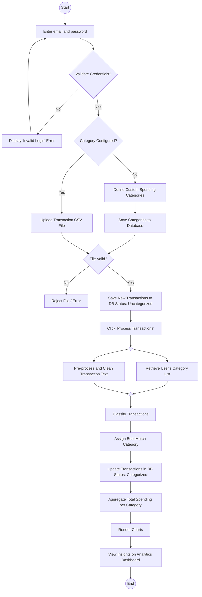

### 4.2 System Sequence Diagrams (SSD)
The System Sequence Diagram (SSD) depicts the interactions between the User, the Smart Transaction System, and the AI Engine over time.

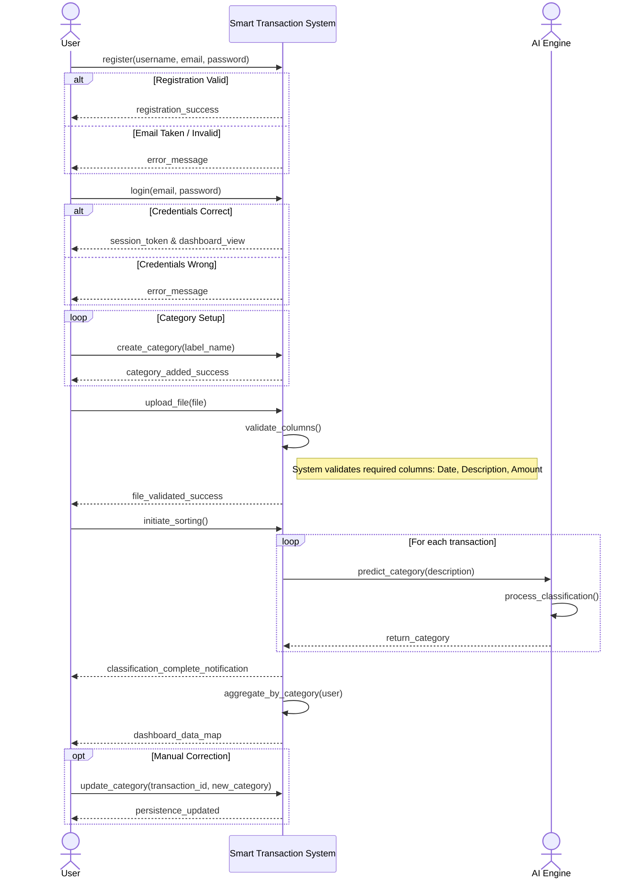

---

## Chapter 5: System Design

### 5.1 Database Design
The database design serves as the foundational data layer for the Smart Transaction Sorter. It ensures that user profiles, custom categories, and large volumes of transaction records are stored efficiently and securely. The design prioritizes data integrity and isolation between different users.

#### 5.1.1 Entity Relationship Diagram (ERD)
The Entity Relationship Diagram visualizes the logical structure of the database. It defines the entities such as Users, Categories, and Transactions and the relationships between them.

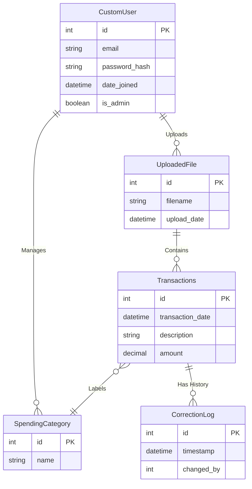

### 5.2 Application Architecture
The application architecture follows a modular structure, separating the user interface, business logic, and data handling. This separation of concerns ensures maintainability and scalability.

#### 5.2.1 Class Diagram
The Class Diagram depicts the static structure of the system. It illustrates the system's classes, their attributes, methods, and the relationships between objects. This includes the Controller classes that handle logic, Service classes that manage data processing, and Model classes that represent the database entities.

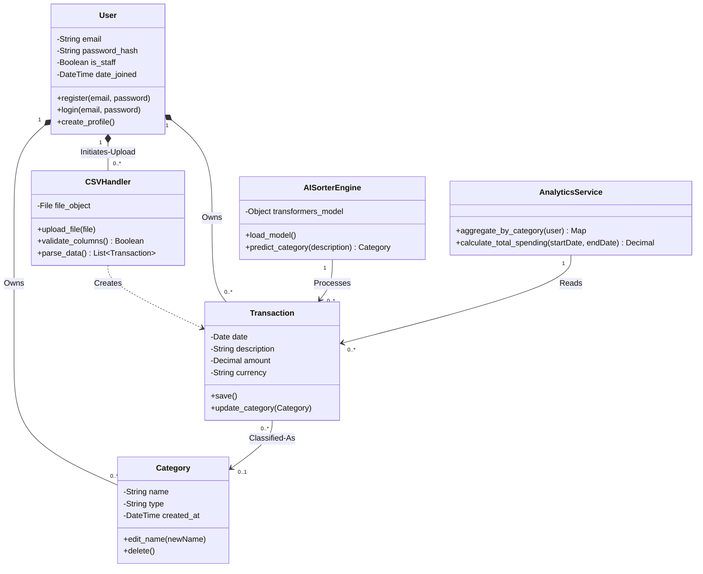

#### 5.2.2 Interaction Design (Sequence Diagrams)

This section details the dynamic behavior of the system. The following Sequence Diagrams illustrate the step-by-step message flow between system objects for the most critical use cases, from the initial user action to the final system response.

#### 1. User Registration Workflow
This interaction details the process of creating a new user account, including validation of unique email addresses and secure password hashing before storage.

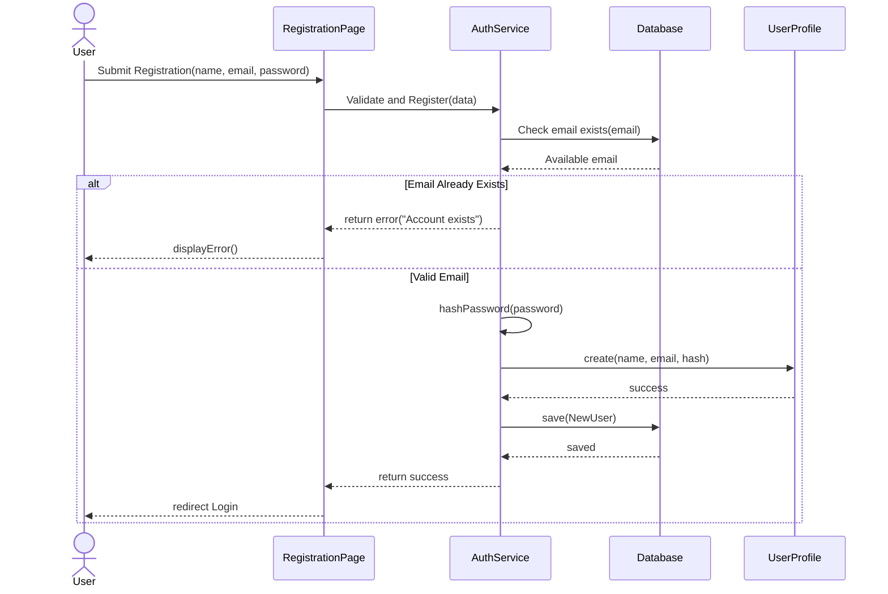

#### 2. Secure Login Workflow
This diagram illustrates the authentication process, verifying credentials against the database and generating a session token upon success.

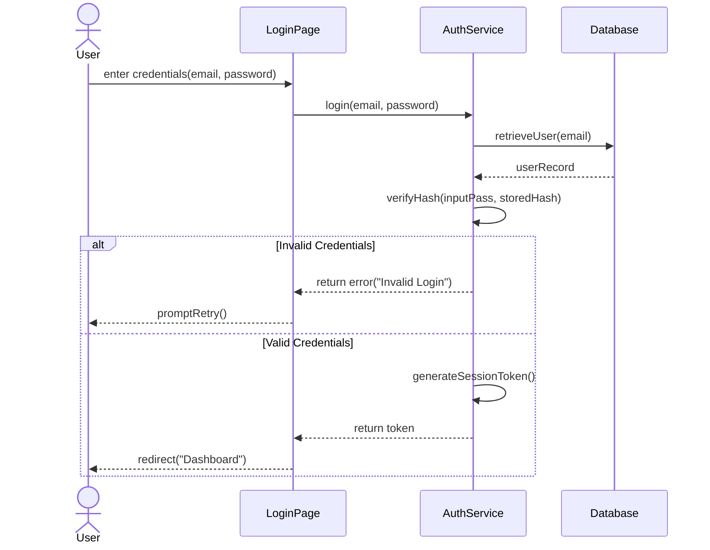

#### 3. Manage Spending Categories Workflow
This flow demonstrates how a user defines custom spending labels (e.g., "Gym", "Groceries") and how the system prevents duplicate category entries.

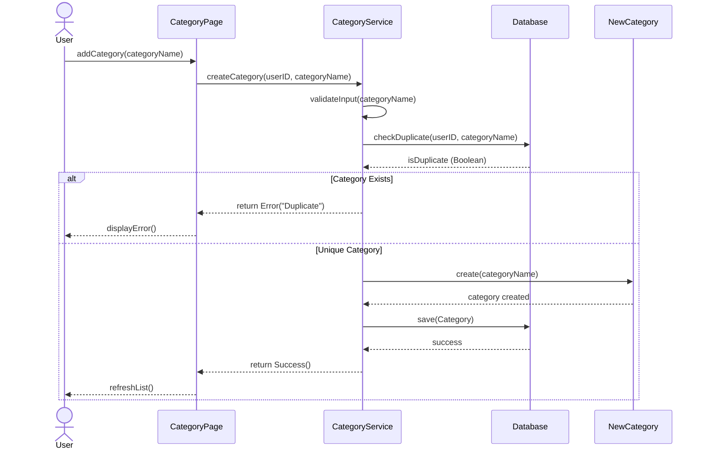

#### 4. CSV Data Upload Workflow
This diagram covers the data ingestion process, including file extension validation (.csv), structure verification (checking columns), and saving raw data.

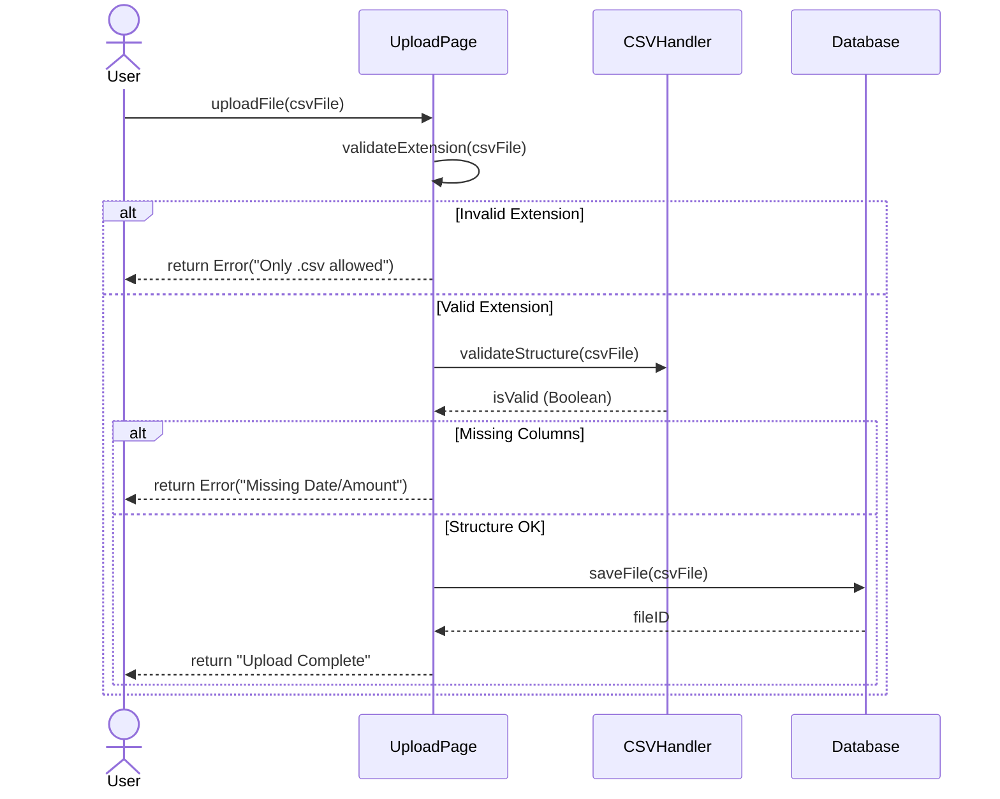

#### 5. AI Transaction Processing Workflow
This is the core system process. It depicts the loop where the AI Engine reads each transaction, predicts the best category based on the user's list, and updates the record.

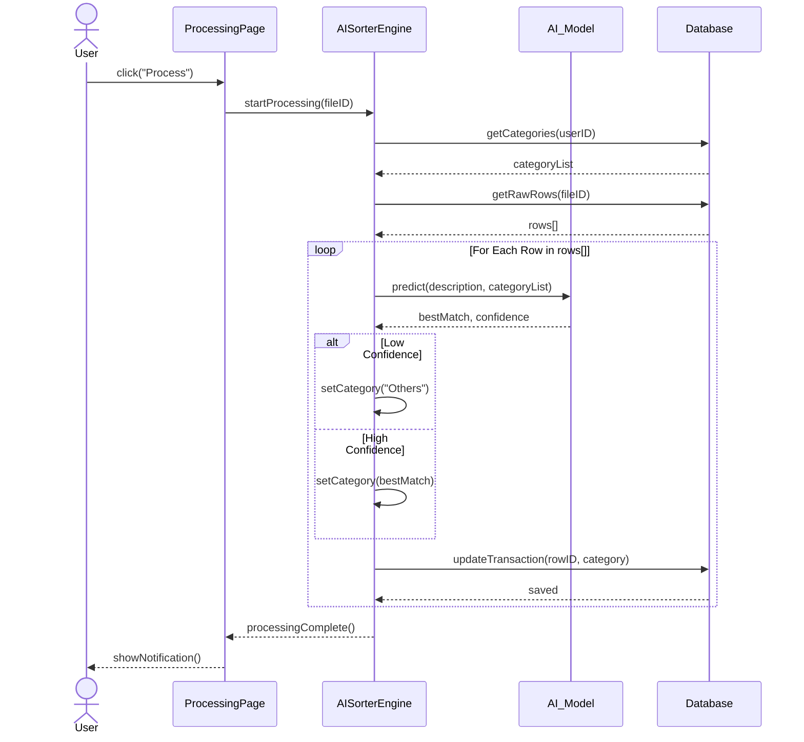

#### 6. Dashboard Analytics Workflow
This interaction shows how the system aggregates classified data from the database and delivers the JSON structure required to render the frontend charts.

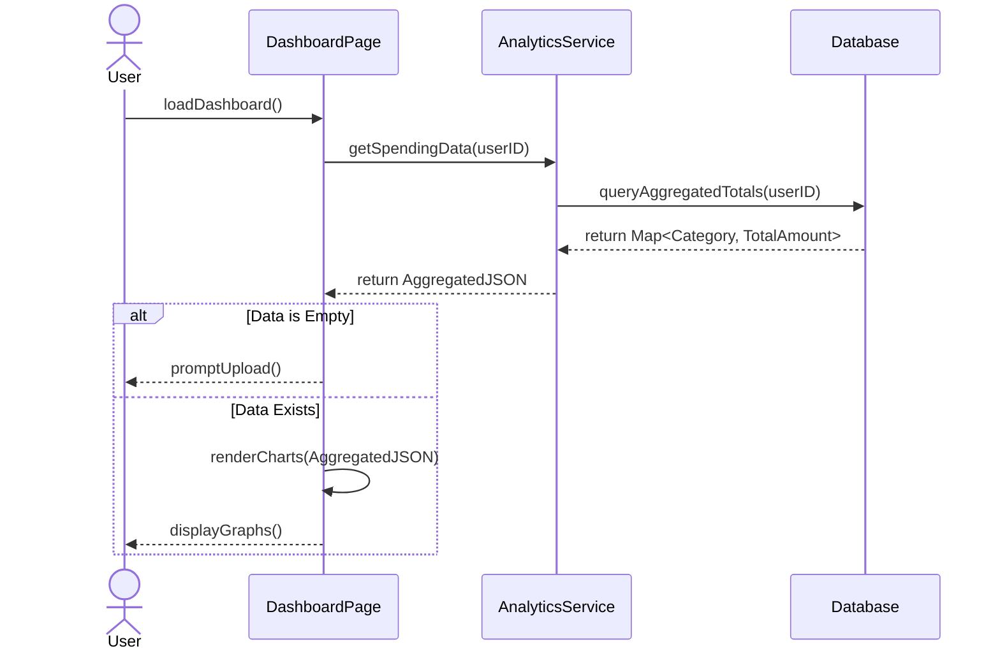

#### 7. Data Deletion Workflow
This diagram illustrates the privacy feature allowing users to permanently erase their data, including the confirmation popup logic to prevent accidental deletion.

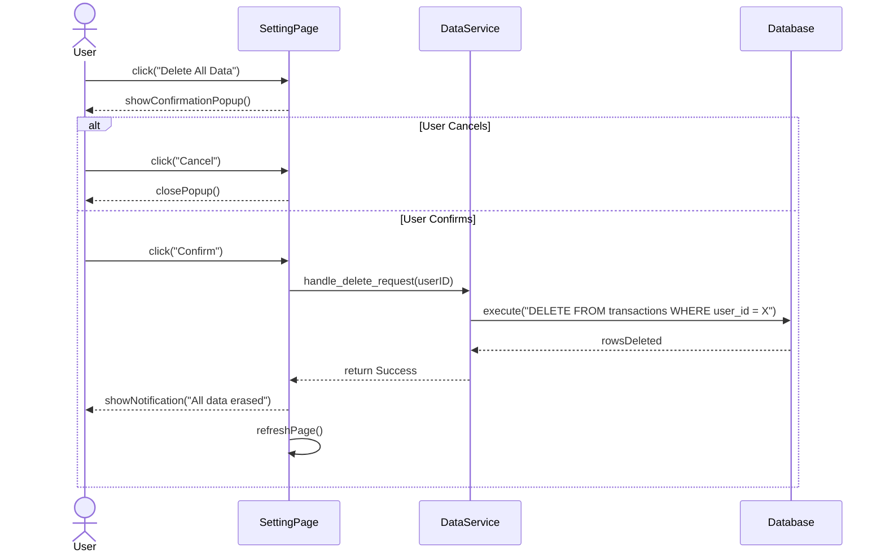

#### 8. Admin User Management Workflow
This final diagram details the administrative capabilities, such as searching for specific users in the system and performing account management actions.

```mermaid
sequenceDiagram
    actor Admin
    participant AdminPage
    participant AdminSystem
    participant Database
    participant UserAccount

    Admin->>AdminPage: searchUser(email)
    AdminPage->>AdminSystem: findUser(email)
    AdminSystem->>Database: query(email)
    Database-->>AdminSystem: userDetails
    AdminSystem-->>AdminPage: displayDetails()
    
    opt Admin decides to delete
        Admin->>AdminPage: click("Delete Account")
        AdminPage->>AdminSystem: deleteUser(userId)
        AdminSystem->>UserAccount: <<destroy>>
        destroy UserAccount
        AdminSystem->>Database: removeRecord(userID)
        Database-->>AdminSystem: success
        AdminSystem-->>AdminPage: successPopup()
    end
```

---

### 5.3 Physical Architecture (Deployment)

The Physical Architecture describes the hardware and software environment in which the system runs. It outlines the deployment nodes, including the client devices (browsers), the web server hosting the Django application, and the database server. The specific configurations are detailed below:

* **Client Node:** Represents the end-user's device (Laptop/Mobile) running a modern web browser (e.g., Chrome, Edge) to access the application via HTTPS.
* **Application Server Node:** The central processing unit hosting the Django web server and the AI Classification Engine. It handles HTTP requests and business logic.
* **Database Node:** A dedicated storage server (PostgreSQL) responsible for persistent data storage, secure transaction logging, and query retrieval.

